example fiducial marker patterns
================================

This page contains example fiducial marker patterns for different cameras that have acquired historical aerial photos,
including what their fiducial marks look like, and the approximate coordinates of the fiducial marks that you can use
to populate the ``MeasuresCamera.xml`` file.

.. note::

    The fiducial markers in the following examples are labeled as follows, with the assumption that the data strip /
    direction of flight marker is on the **left side** of the image:

    - **P1**: the lower left corner of the image
    - **P2**: the upper right corner of the image
    - **P3**: the upper left corner of the image
    - **P4**: the lower right corner of the image
    - **P5**: the middle of the left edge image
    - **P6**: the middle of the right edge of the image
    - **P7**: the middle of the top edge of the image
    - **P8**: the middle of the bottom edge of the image

a note on identification
------------------------

Aside from a single 1960 article\ [1]_, I have not managed to find much solid information about different fiducial
marker patterns used by different camera manufacturers in different cameras. Some patterns are relatively distinct,
but others are both very similar and widely used, making a definitive identification based on the fiducial pattern
alone challenging, especially for earlier cameras that did not expose this ancillary information on the image negative.

A good deal of the information on this page has been pieced together from looking at a very large number of images
and calibration reports downloaded from `EarthExplorer <https://earthexplorer.usgs.gov/>`__ and the USGS
`Camera Calibration Report Database <https://calval.cr.usgs.gov/cameracal/reports.html>`__. This guide is by no means
exhaustive, though it is built on a fairly large dataset of example images.

.. note::

    If you have a calibration report that corresponds to your specific images, **you should use that instead**.

    The information provided here is for those cases where a calibration report does not exist, or has been lost to time.

.. tip::

    For images acquired by the US Government or other agencies and hosted on `EarthExplorer <https://earthexplorer.usgs.gov/>`__,
    you may be able to find a calibration report by using the lens or camera serial number, if this was recorded on the
    camera's data strip (or, sometimes, written around the edges of the frame).

    With the serial number(s) and/or other identifying information (e.g., make/model), you can use the USGS
    `Camera Calibration Report Database <https://calval.cr.usgs.gov/cameracal/reports.html>`__ to search for the
    calibration report for your camera (or a similar camera).

"wing-type" fiducials
---------------------

A number of different camera manufacturers have used four "wing-shaped" mid-side fiducial markers of varying designs:

- Aero Service Corporation (also Aero/View cameras, or just "Aero")
- Airagon
- Mark Hurd Aerial Surveys, Inc.
- Park Aerial Surveys, Inc.
- Fairchild
- Wes Smith

Many of the cameras made/used by Mark Hurd Aerial Surveys, Inc., Park Aerial Surveys, Inc., or similar companies
do not appear to have model names - rather, they are identified only by a number. The lenses used in these cameras
tend to be made by manufacturers such as Bausch and Lomb (e.g., the Metrogon Lens), C. P. Goerz (e.g., the Aerotar
lens), or Zeiss (e.g., the Pleogon lens).

.. tip::

    Because:

    - the measured separation between P5-P6 and P7-P8 is somewhat variable for these images, even for the same camera
      manufacturer (and sometimes even the same camera...); and
    - the majority of these cameras were used before coordinates were regularly included in calibration reports,

    it is probably a better idea to use :py:meth:`estimate_measures_camera <spymicmac.micmac.estimate_measures_camera>`
    with a large sample of these images (and the known scanning resolution), rather than the approximate coordinates
    given below.

hollow-type wing
^^^^^^^^^^^^^^^^^

Cameras with this style of fiducial marker (four mid-side 'wing' markers that are at least semi-transparent) seem to
have been made by Mark Hurd Aerial Surveys, Inc. They do not have any particular model name, and are recorded with
single- or double-digit serial numbers in most calibration reports on file. They used a few different lens types,
mostly Bausch and Lomb Metrogon with a 6" (152 mm) focal length.

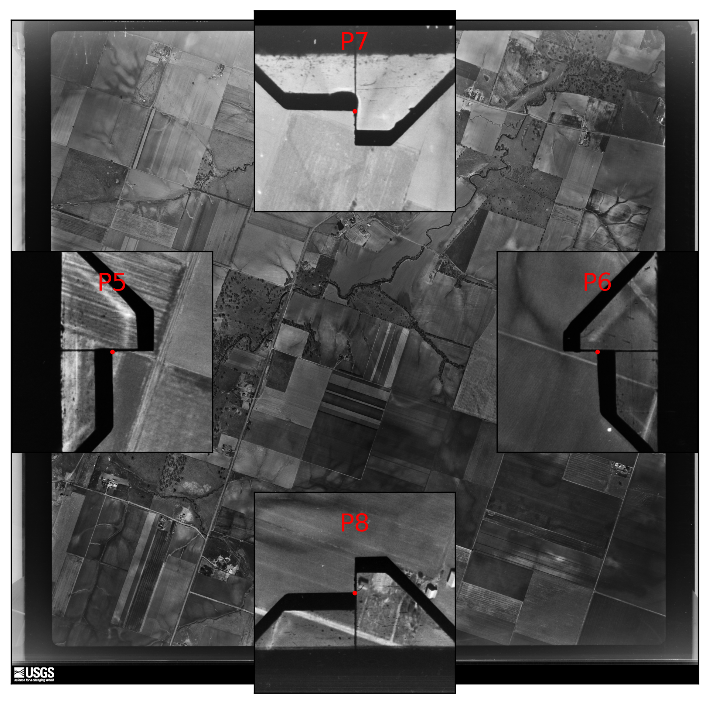

|br|

**Marker Separation (n = 3 reports)**

+-----------+-----------------+----------+
| markers   | mean            |   median |
+===========+=================+==========+
| P5 - P6   | 221.887 ± 0.097 |   221.91 |
+-----------+-----------------+----------+
| P7 - P8   | 221.780 ± 0.070 |   221.78 |
+-----------+-----------------+----------+

flat wing (small)
^^^^^^^^^^^^^^^^^

This style is perhaps the most common of the wing-type (at least by volume in EarthExplorer), and seems to have been
used by a wide range of manufacturers:

- Fairchild (K-3B "modified", K-17, K-17 "modified", K-17B "modified")\ [2]_
- Aero Services (Aero, Aero/View)
- Airagon
- Western Aerial Contractors
- Park (Twinplex, unnamed)

Some, but not all, of these used a direction of flight indicator similar to the one shown below on P5. Some models
also had early data strip styles, with both serial number and calibrated focal length included in the image (the
example below, from a Park camera, has these on the left side of the frame).

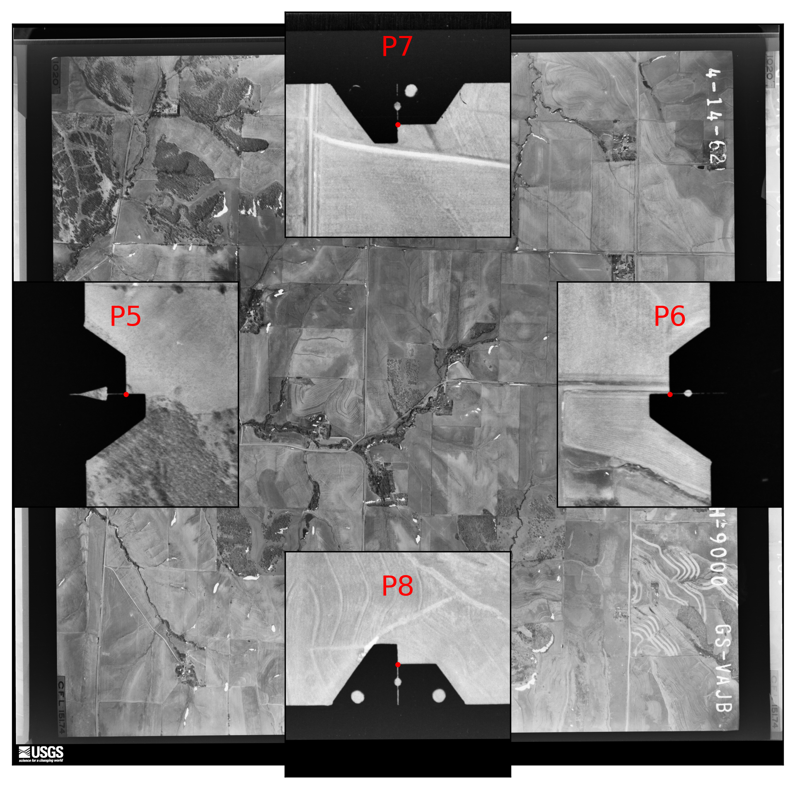

|br|

**Marker Separation (n = 120 reports)**

+-----------+-----------------+----------+
| markers   | mean            |   median |
+===========+=================+==========+
| P5 - P6   | 222.698 ± 0.489 |  222.49  |
+-----------+-----------------+----------+
| P7 - P8   | 222.773 ± 0.659 |  222.495 |
+-----------+-----------------+----------+

flat wing (large)
^^^^^^^^^^^^^^^^^

A larger version of the "flat" wing was used in at least the Fairchild F-224 and K-17A cameras. In the lower-right
corner of the frame, there is sometimes an indicator with the focal length (when not overwritten by other markings
on the print, that is).

Note also the diamond-shaped marker on P5, which I am taking to be the "direction of flight marker" as the arrow-shaped
notches on both P5 and P6 point in opposing directions.

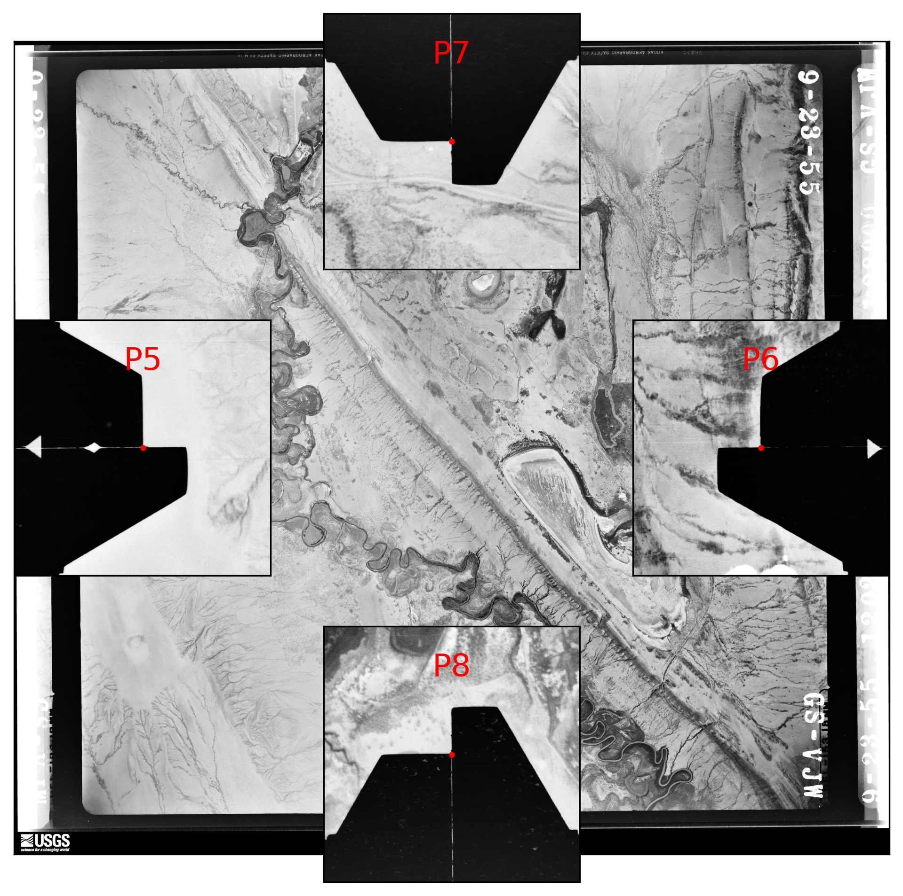

|br|

**Marker Separation (n = 1 reports)**

+-----------+---------------+----------+
| markers   | mean          |   median |
+===========+===============+==========+
| P5 - P6   | 217.490 ± nan |   217.49 |
+-----------+---------------+----------+
| P7 - P8   | 217.510 ± nan |   217.51 |
+-----------+---------------+----------+

flat wing (tall)
^^^^^^^^^^^^^^^^^

A "tall" version of the "flat" wing was used in primarily Aero Services (also labeled as Aero, Aero/View) cameras. Some
versions of these cameras have a small marker that includes the camera number on it, usually just below P5. Note also
the diamond-shaped marker on P5, which I am taking to be the "direction of flight marker".

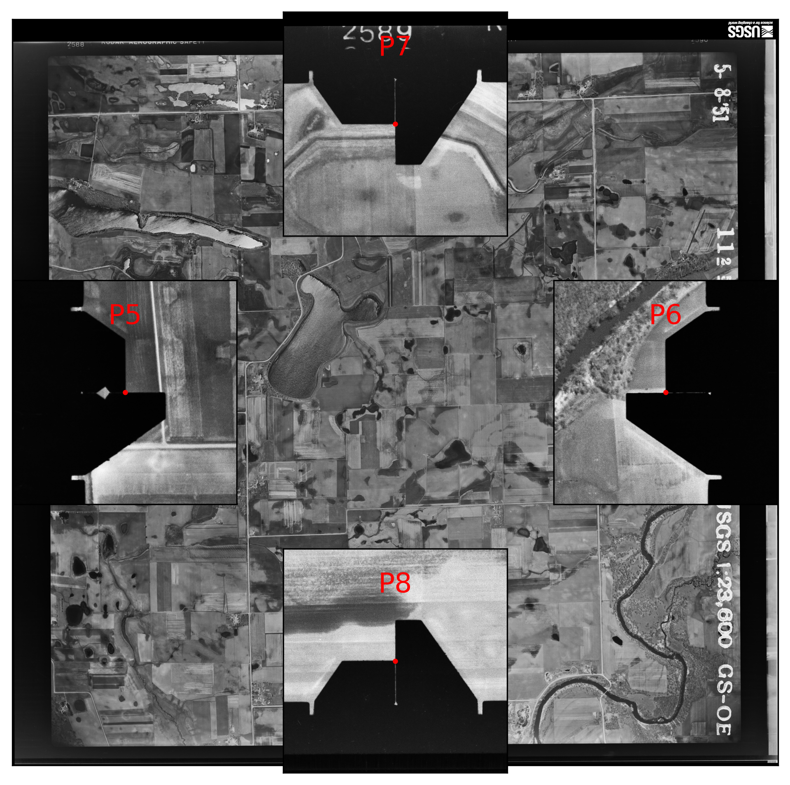

|br|

**Marker Separation (n = 5 reports)**

+-----------+-----------------+----------+
| markers   | mean            |   median |
+===========+=================+==========+
| P5 - P6   | 222.596 ± 0.984 |   222.41 |
+-----------+-----------------+----------+
| P7 - P8   | 223.010 ± 0.557 |   223.02 |
+-----------+-----------------+----------+

flat wing (curved)
^^^^^^^^^^^^^^^^^^

This design was used primarily in cameras manufactured by Wes Smith (or just "Smith"). Note that marker P5 in the
example below has a "direction of flight" indicator, meant to point in the direction that the plane was flying (in
this case, towards the right of the frame):

.. image:: img/curved_flat_wing.png
    :width: 500
    :align: center
    :alt: a diagram of a camera with four "curved wing" mid-side fiducial markers

|br|

**Marker Separation (n = 6 reports)**

+-----------+-----------------+----------+
| markers   | mean            |   median |
+===========+=================+==========+
| P5 - P6   | 221.322 ± 1.038 |  221.51  |
+-----------+-----------------+----------+
| P7 - P8   | 221.598 ± 1.423 |  222.055 |
+-----------+-----------------+----------+

curved wing
^^^^^^^^^^^

This design was used in at least some versions of the K-17 "modified" camera. Note that three of the markers have
notches on either side, or are slightly inset from the rest of the frame - in the absence of any other identifying
marks, I am taking P5 to be the odd one out.

.. image:: img/curved_wing.png
    :width: 500
    :align: center
    :alt: a diagram of a camera with four "curved wing" mid-side fiducial markers

|br|

**Marker Separation (n = 4 reports)**

+-----------+-----------------+----------+
| markers   | mean            |   median |
+===========+=================+==========+
| P5 - P6   | 222.295 ± 0.135 |  222.345 |
+-----------+-----------------+----------+
| P7 - P8   | 222.330 ± 0.076 |  222.355 |
+-----------+-----------------+----------+

.. _fairchild k17:

sharp wing
^^^^^^^^^^

This design was used in at least the Fairchild K-17 and some "modified" versions of the K-17 camera. As with the
F-224 and K-17B cameras, there is a strip indicating the calibrated focal length in the lower right-hand corner of the
frame, as well as a "direction of flight" marker on P5:

.. image:: img/sharp_wing.png
    :width: 500
    :align: center
    :alt: a diagram of a camera with four "sharp wing" mid-side fiducial markers

|br|

**Marker Separation (n = 3 reports)**

+-----------+-----------------+----------+
| markers   | mean            |   median |
+===========+=================+==========+
| P5 - P6   | 226.160 ± 0.694 |   225.88 |
+-----------+-----------------+----------+
| P7 - P8   | 226.063 ± 0.808 |   225.87 |
+-----------+-----------------+----------+

Fairchild Cameras
-----------------

arrow-type fiducials
^^^^^^^^^^^^^^^^^^^^^

.. caution::

    I have only been able to identify a single example of this type of fiducial marker connected to a calibration
    report, and to notes made on the edges of the frame of an image from a separate survey.

    The reported camera in both cases was a Fairchild K-17, but I am hesitant to definitively state this. As with the
    wing-type examples shown above, I recommend using
    :py:meth:`estimate_measures_camera <spymicmac.micmac.estimate_measures_camera>` in the absence of any definitive
    marker coordinates.

These cameras have four mid-side fiducial markers. Both P5 and P6 are "arrows" that point in the direction of flight.
P5 is the tip of the arrow-shaped notch that is level with the frame, while P6 is the tip of the arrow-shaped notch
that is cut into the frame.

Many prints (or scans) of images of this type will cut off the point of the notch on P7 and P8, so it is probably
better to use the point where the vertical edge of the notch instersects the image frame, rather than the "point" of
the notch.

.. image:: img/arrow.png
    :width: 500
    :align: center
    :alt: a diagram of a fairchild k-17 "arrow" type fiducial marker pattern

notch-type fiducials
^^^^^^^^^^^^^^^^^^^^

.. _fairchild t11d:

mid-side only
""""""""""""""

This pattern was used in a number of different cameras, including T-11, T-12, KC-1, and KC-1B. Note that the marker
location is given by a small pinhole just inside the frame of the image, rather than the notch-shaped marks in the
frame. Note also the distance between P5 and the principal point is longer than the distance between P6 and the
principal point.

.. image:: img/fairchild_t11_notch.png
    :width: 500
    :align: center
    :alt: a diagram of a fairchild t-11 notch-type fiducial marker pattern with fiducial markers labeled

|br|

**Marker Separation (n = 27 reports)**

+-----------+-----------------+----------+
| markers   | mean            |   median |
+===========+=================+==========+
| P5 - P6   | 237.946 ± 0.223 |  237.94  |
+-----------+-----------------+----------+
| P7 - P8   | 235.035 ± 0.206 |  235.016 |
+-----------+-----------------+----------+

**Marker Location (n = 2 reports)**

+--------+-----------------+-----------------+---------+
| name   | x               | y               |   angle |
+========+=================+=================+=========+
| P5     | 0.000 ± 0.063   | 117.521 ± 0.007 | 179.995 |
+--------+-----------------+-----------------+---------+
| P6     | 237.846 ± 0.050 | 117.521 ± 0.007 |   0.005 |
+--------+-----------------+-----------------+---------+
| P7     | 120.428 ± 0.001 | 0.000 ± 0.038   |  89.995 |
+--------+-----------------+-----------------+---------+
| P8     | 120.421 ± 0.007 | 235.000 ± 0.053 | 270.001 |
+--------+-----------------+-----------------+---------+

T-12
"""""

Similar to the pattern shown above, the T-12 also used corner fiducial markers. Note that the fiducial marker
for each of these is a small pinhole just inside the frame, rather than the notch-shaped marks in the frame.

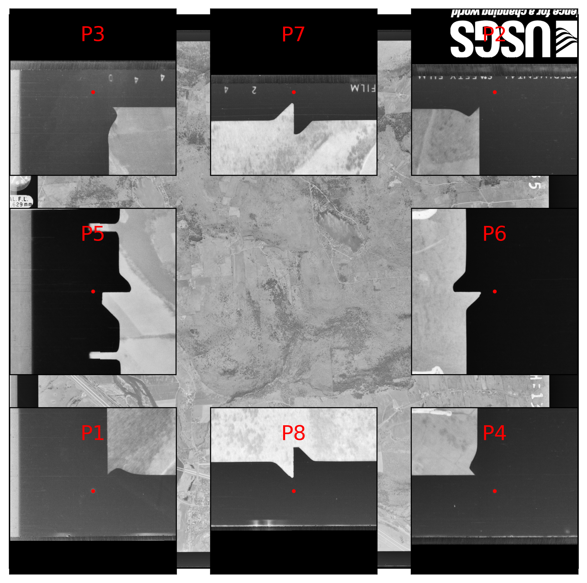

|br|

.. note::

    In some of these models, P5 is further inside of the left-hand side of the frame, which is why the variability of
    the P5-P6 separation, and the x location of P5, is much higher than for the other markers.

**Marker Separation (n = 5 reports)**

+-----------+-----------------+----------+
| markers   | mean            |   median |
+===========+=================+==========+
| P5 - P6   | 236.403 ± 1.657 |  235.201 |
+-----------+-----------------+----------+
| P7 - P8   | 235.236 ± 0.137 |  235.205 |
+-----------+-----------------+----------+
| P1 - P2   | 328.163 ± 0.850 |  328.256 |
+-----------+-----------------+----------+
| P3 - P4   | 328.156 ± 0.838 |  328.24  |
+-----------+-----------------+----------+

**Marker Location (n = 3 reports)**

+--------+-----------------+-----------------+---------+
| name   | x               | y               |   angle |
+========+=================+=================+=========+
| P1     | 3.601 ± 0.335   | 233.519 ± 0.296 | 224.999 |
+--------+-----------------+-----------------+---------+
| P2     | 235.453 ± 0.321 | 1.622 ± 0.303   |  45.012 |
+--------+-----------------+-----------------+---------+
| P3     | 3.619 ± 0.302   | 1.664 ± 0.372   | 135.004 |
+--------+-----------------+-----------------+---------+
| P4     | 235.517 ± 0.274 | 233.519 ± 0.296 | 315.007 |
+--------+-----------------+-----------------+---------+
| P5     | 0.000 ± 1.694   | 117.645 ± 0.083 | 180.033 |
+--------+-----------------+-----------------+---------+
| P6     | 237.211 ± 0.118 | 117.481 ± 0.079 |   0.046 |
+--------+-----------------+-----------------+---------+
| P7     | 119.465 ± 0.072 | 0.000 ± 0.112   |  90.039 |
+--------+-----------------+-----------------+---------+
| P8     | 119.613 ± 0.059 | 235.248 ± 0.113 | 270.033 |
+--------+-----------------+-----------------+---------+

The T-12 camera also used cross-type fiducial markers instead of dots, with the same approximate measurements:

.. image:: img/fairchild_t12_cross.png
    :width: 500
    :align: center
    :alt: a diagram of a fairchild t-12 notch-type fiducial marker pattern with fiducial markers labeled

T-5
""""

Based on diagrams like this one, which are included in some calibration reports, I am taking the location of each
fiducial marker to be the corner formed by the horizontal/vertical edge of the notch, and the image frame:

.. image:: img/report_diagram.png
    :width: 700
    :align: center
    :alt: a diagram showing where the measurements were made for estimating the fiducial marker separation

|br| If the data strip is not visible on the image, you should be able to identify P5 as being a slightly larger than
the other three notches.

.. image:: img/t5_notch.png
    :width: 500
    :align: center
    :alt: a diagram of a Fairchild T-5 with fiducial markers labeled

|br|

**Marker Separation (n = 4 reports)**

+-----------+-----------------+----------+
| markers   | mean            |   median |
+===========+=================+==========+
| P5 - P6   | 229.688 ± 0.219 |  229.645 |
+-----------+-----------------+----------+
| P7 - P8   | 229.950 ± 0.014 |  229.955 |
+-----------+-----------------+----------+

KC-6A
""""""

Example coming soon...

checker-type fiducials
^^^^^^^^^^^^^^^^^^^^^^

.. _fairchild t11s:

T-11
""""

Some versions of the T-11 used checker-type fiducials like the one shown below. Note the direction of flight indicator
next to the P5 marker:

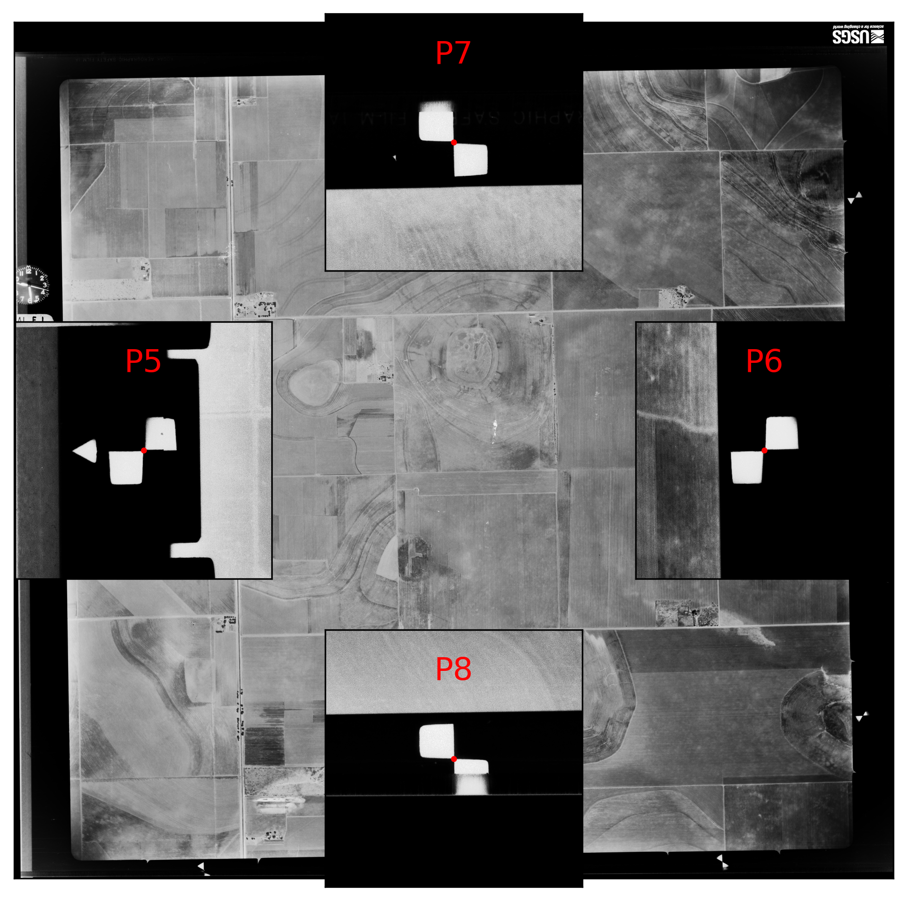

Park Cameras
-------------

In addition to the wing-style fiducial marker pattern, Park Aerial Surveys, Inc. manufactured and used cameras with
eight crosshair-style fiducial markers (four corner, four mid-side).

These look very similar to the Wild Heerbrugg RC8 and RC10 crosshair-style cameras shown below, but are distinguished
by the corner fiducial markers being closer to the frame (further from the principal point) and set inside of a
smaller rounded frame:

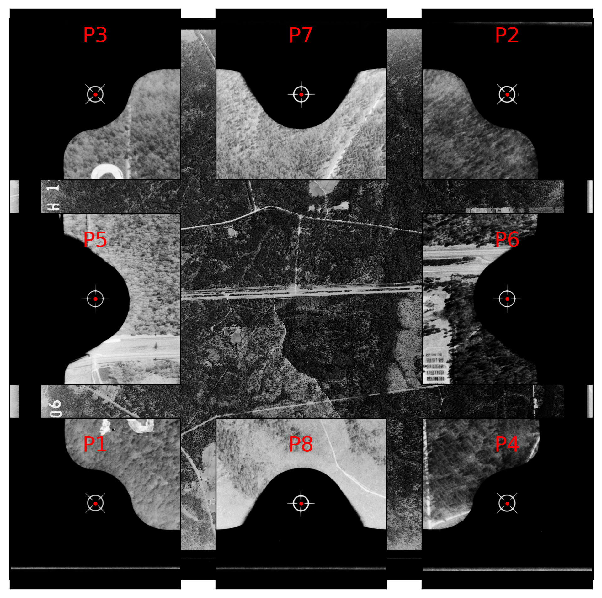

|br| Some, but not all, of these cameras also displayed either the camera serial number and focal length, or just the
focal length, on the side of the frame near one of the fiducial markers.

**Marker Separation (n = 12 reports)**

+-----------+-----------------+----------+
| markers   | mean            |   median |
+===========+=================+==========+
| P5 - P6   | 223.781 ± 0.039 |  223.786 |
+-----------+-----------------+----------+
| P7 - P8   | 223.793 ± 0.032 |  223.802 |
+-----------+-----------------+----------+
| P1 - P2   | 316.532 ± 0.033 |  316.537 |
+-----------+-----------------+----------+
| P3 - P4   | 316.524 ± 0.028 |  316.52  |
+-----------+-----------------+----------+

**Marker Location (n = 6 reports)**

+--------+-----------------+-----------------+---------+
| name   | x               | y               |   angle |
+========+=================+=================+=========+
| P1     | 0.000 ± 0.021   | 223.825 ± 0.015 | 224.995 |
+--------+-----------------+-----------------+---------+
| P2     | 223.808 ± 0.022 | 0.000 ± 0.016   |  45.009 |
+--------+-----------------+-----------------+---------+
| P3     | 0.005 ± 0.009   | 0.028 ± 0.017   | 135.001 |
+--------+-----------------+-----------------+---------+
| P4     | 223.821 ± 0.017 | 223.825 ± 0.015 | 315.004 |
+--------+-----------------+-----------------+---------+
| P5     | 0.033 ± 0.018   | 111.922 ± 0.016 | 179.996 |
+--------+-----------------+-----------------+---------+
| P6     | 223.804 ± 0.035 | 111.909 ± 0.014 |   0.011 |
+--------+-----------------+-----------------+---------+
| P7     | 111.900 ± 0.019 | 0.037 ± 0.019   |  90.006 |
+--------+-----------------+-----------------+---------+
| P8     | 111.932 ± 0.012 | 223.821 ± 0.020 | 270.01  |
+--------+-----------------+-----------------+---------+

Wild Heerbrugg Cameras
----------------------

.. _wild rc5:

corner-only fiducials
^^^^^^^^^^^^^^^^^^^^^

Earlier Wild RC cameras, such as the RC5 or RC5A, or earlier versions of the RC8 or RC9, have four cross-shaped fiducial
marks in the corners, set inside of a rounded frame:

.. image:: img/wild_corner.png
    :width: 500
    :align: center
    :alt: an example of a Wild corner with corner fiducial markers labeled

|br| Some versions also used an alternate corner marker:

.. image:: img/wild_light_corner.png
    :width: 500
    :align: center
    :alt: an example of a Wild camera with corner fiducial markers labeled

|br|

**Marker Separation (n = 48 reports)**

+-----------+-----------------+----------+
| markers   | mean            |   median |
+===========+=================+==========+
| P1 - P2   | 299.815 ± 0.011 |  299.813 |
+-----------+-----------------+----------+
| P3 - P4   | 299.818 ± 0.013 |  299.818 |
+-----------+-----------------+----------+

**Marker Location (n = 15 reports)**

+--------+-----------------+-----------------+---------+
| name   | x               | y               |   angle |
+========+=================+=================+=========+
| P1     | 0.000 ± 0.010   | 212.002 ± 0.008 | 225.001 |
+--------+-----------------+-----------------+---------+
| P2     | 211.999 ± 0.014 | 0.000 ± 0.015   | 45.000  |
+--------+-----------------+-----------------+---------+
| P3     | 0.000 ± 0.012   | 0.001 ± 0.010   | 135.001 |
+--------+-----------------+-----------------+---------+
| P4     | 212.006 ± 0.007 | 212.002 ± 0.008 | 315.000 |
+--------+-----------------+-----------------+---------+

**Marker Separation (alternate corner, n = 2)**

+-----------+-----------------+----------+
| markers   | mean            |   median |
+===========+=================+==========+
| P1 - P2   | 299.842 ± 0.003 |  299.842 |
+-----------+-----------------+----------+
| P3 - P4   | 299.798 ± 0.017 |  299.798 |
+-----------+-----------------+----------+

.. _wild rc10:

corner + mid-side fiducials
^^^^^^^^^^^^^^^^^^^^^^^^^^^^^

Later versions of the RC8 camera, as well as the RC10 camera, used a pattern with eight fiducial markers: four corner
markers as on the corner type, and four mid-side markers.

These markers may be all larger crosses, as in the corner marker types (these were typically RC8 cameras):

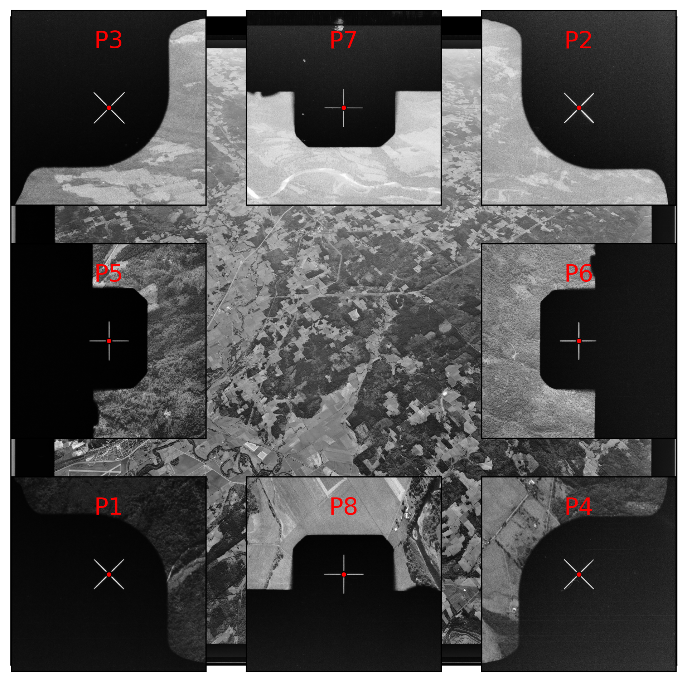

|br|

**Marker Separation (n = 32 reports)**

+-----------+-----------------+----------+
| markers   | mean            |   median |
+===========+=================+==========+
| P5 - P6   | 219.995 ± 0.008 |  219.996 |
+-----------+-----------------+----------+
| P7 - P8   | 219.998 ± 0.009 |  220     |
+-----------+-----------------+----------+
| P1 - P2   | 299.815 ± 0.009 |  299.813 |
+-----------+-----------------+----------+
| P3 - P4   | 299.805 ± 0.008 |  299.803 |
+-----------+-----------------+----------+

**Marker Location (n = 15 reports)**

+--------+-----------------+-----------------+---------+
| name   | x               | y               |   angle |
+========+=================+=================+=========+
| P1     | 3.998 ± 0.010   | 215.993 ± 0.010 | 224.998 |
+--------+-----------------+-----------------+---------+
| P2     | 216.004 ± 0.006 | 4.000 ± 0.009   |  44.999 |
+--------+-----------------+-----------------+---------+
| P3     | 3.998 ± 0.006   | 3.997 ± 0.011   | 135     |
+--------+-----------------+-----------------+---------+
| P4     | 215.989 ± 0.010 | 215.993 ± 0.010 | 314.999 |
+--------+-----------------+-----------------+---------+
| P5     | 0.000 ± 0.006   | 109.996 ± 0.012 | 179.998 |
+--------+-----------------+-----------------+---------+
| P6     | 219.996 ± 0.010 | 110.000 ± 0.009 | 359.999 |
+--------+-----------------+-----------------+---------+
| P7     | 110.004 ± 0.006 | 0.000 ± 0.010   |  89.998 |
+--------+-----------------+-----------------+---------+
| P8     | 109.994 ± 0.013 | 220.001 ± 0.012 | 269.997 |
+--------+-----------------+-----------------+---------+

Or, the markers might be a mix of cross-style markers in the corner, and crosshair style on the mid-side markers
(again, these are typically RC8 cameras):

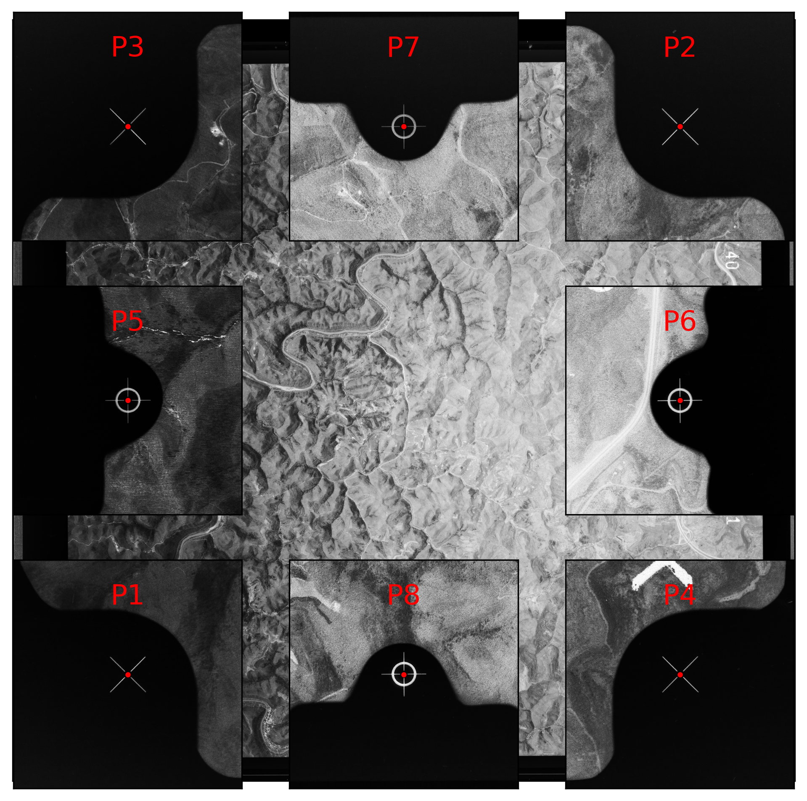

|br|

**Marker Separation (n = 10 reports)**

+-----------+-----------------+----------+
| markers   | mean            |   median |
+===========+=================+==========+
| P5 - P6   | 220.000 ± 0.011 |  219.999 |
+-----------+-----------------+----------+
| P7 - P8   | 220.005 ± 0.008 |  220.004 |
+-----------+-----------------+----------+
| P1 - P2   | 299.815 ± 0.009 |  299.814 |
+-----------+-----------------+----------+
| P3 - P4   | 299.810 ± 0.009 |  299.812 |
+-----------+-----------------+----------+

**Marker Location (n = 9 reports)**

+--------+-----------------+-----------------+---------+
| name   | x               | y               |   angle |
+========+=================+=================+=========+
| P1     | 4.002 ± 0.012   | 216.000 ± 0.009 | 224.999 |
+--------+-----------------+-----------------+---------+
| P2     | 216.006 ± 0.013 | 4.000 ± 0.012   |  45     |
+--------+-----------------+-----------------+---------+
| P3     | 4.002 ± 0.007   | 3.999 ± 0.009   | 134.999 |
+--------+-----------------+-----------------+---------+
| P4     | 215.997 ± 0.009 | 216.000 ± 0.009 | 314.999 |
+--------+-----------------+-----------------+---------+
| P5     | 0.000 ± 0.009   | 110.005 ± 0.015 | 180.002 |
+--------+-----------------+-----------------+---------+
| P6     | 220.000 ± 0.012 | 109.999 ± 0.011 |   0.001 |
+--------+-----------------+-----------------+---------+
| P7     | 110.006 ± 0.012 | 0.000 ± 0.012   |  89.998 |
+--------+-----------------+-----------------+---------+
| P8     | 109.996 ± 0.009 | 220.004 ± 0.010 | 269.997 |
+--------+-----------------+-----------------+---------+

|br| Or, they might be all crosshair style markers (typically RC10 cameras):

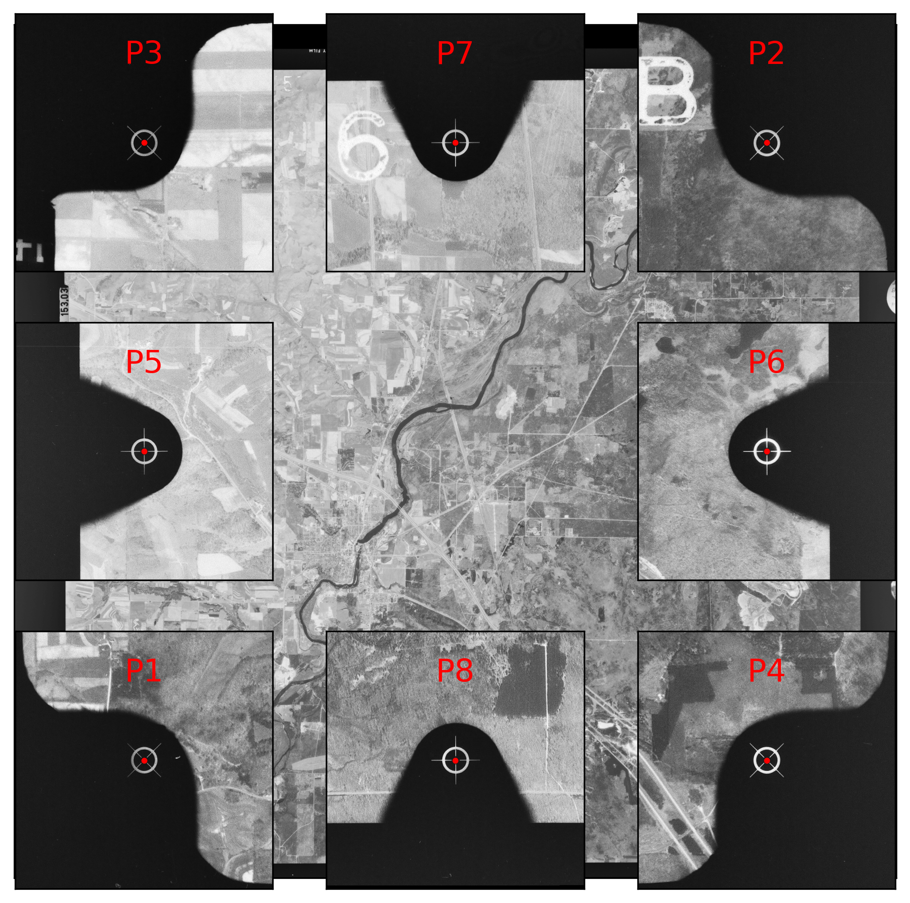

|br|

**Marker Separation (n = 23 reports)**

+-----------+-----------------+----------+
| markers   | mean            |   median |
+===========+=================+==========+
| P5 - P6   | 220.008 ± 0.048 |  219.999 |
+-----------+-----------------+----------+
| P7 - P8   | 219.998 ± 0.009 |  220     |
+-----------+-----------------+----------+
| P1 - P2   | 299.814 ± 0.008 |  299.814 |
+-----------+-----------------+----------+
| P3 - P4   | 299.807 ± 0.012 |  299.806 |
+-----------+-----------------+----------+

**Marker Location (n = 16 reports)**

+--------+-----------------+-----------------+---------+
| name   | x               | y               |   angle |
+========+=================+=================+=========+
| P1     | 3.999 ± 0.013   | 215.998 ± 0.006 | 225     |
+--------+-----------------+-----------------+---------+
| P2     | 216.003 ± 0.014 | 4.002 ± 0.007   |  44.998 |
+--------+-----------------+-----------------+---------+
| P3     | 4.005 ± 0.012   | 4.002 ± 0.006   | 134.997 |
+--------+-----------------+-----------------+---------+
| P4     | 215.992 ± 0.013 | 215.998 ± 0.006 | 315     |
+--------+-----------------+-----------------+---------+
| P5     | 0.000 ± 0.012   | 109.999 ± 0.011 | 179.999 |
+--------+-----------------+-----------------+---------+
| P6     | 220.012 ± 0.060 | 109.998 ± 0.009 |   0.002 |
+--------+-----------------+-----------------+---------+
| P7     | 110.002 ± 0.012 | 0.000 ± 0.007   |  89.996 |
+--------+-----------------+-----------------+---------+
| P8     | 109.997 ± 0.013 | 219.996 ± 0.007 | 270.001 |
+--------+-----------------+-----------------+---------+

.. _zeiss midside:

Zeiss RMK Cameras
-----------------

.. note::

    The model name for the Zeiss RMK includes information about the lens and film type. For example:

    - **Zeiss RMK 15/23** means that the camera uses a Pleogon lens with a ~15 cm (~150 mm) focal length and 23 cm film.
    - **Zeiss RMK A 15/23** means that the camera uses a Pleogon A lens with a ~15 cm focal length and 23 cm film.
    - **Zeiss RMK A 21/23** means that the camera uses a Pleogon A lens with a ~21 cm focal length and 23 cm film.
    - **Zeiss RMK A 30/23** means that the camera uses a Pleogon A lens with a ~30 cm focal length and 23 cm film

    ... and so on. This pattern doesn't necessarily tell you the pattern of the fiducial markers, but it should at
    least give you a rough idea of the focal length and film size of the camera.

mid-side only
^^^^^^^^^^^^^

Earlier models tended to use only mid-side fiducial markers:

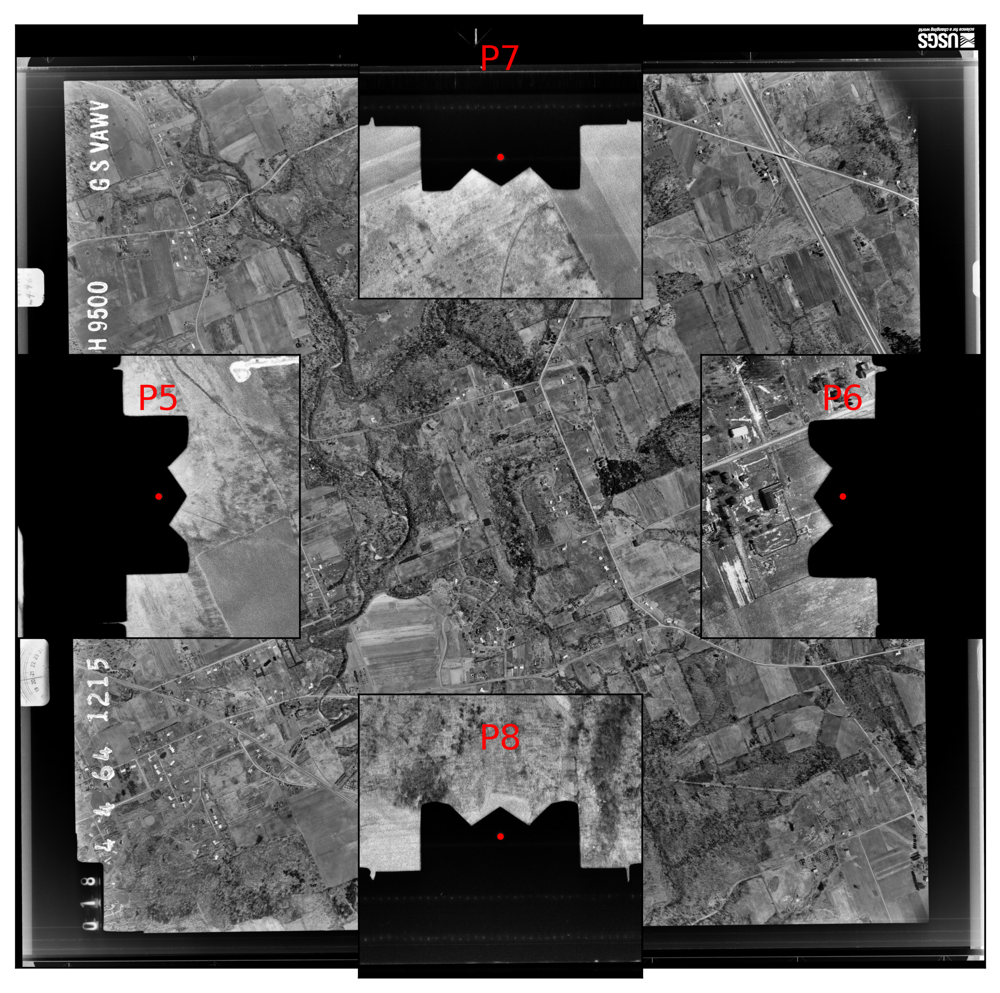

|br|

**Marker Separation (n = 41 reports)**

+-----------+-----------------+----------+
| markers   | mean            |   median |
+===========+=================+==========+
| P5 - P6   | 225.995 ± 0.062 |  226.001 |
+-----------+-----------------+----------+
| P7 - P8   | 226.008 ± 0.038 |  226.01  |
+-----------+-----------------+----------+

**Marker Location (n = 5 reports)**

+--------+-----------------+-----------------+---------+
| name   | x               | y               |   angle |
+========+=================+=================+=========+
| P5     | 0.000 ± 0.008   | 112.978 ± 0.009 | 180.002 |
+--------+-----------------+-----------------+---------+
| P6     | 225.983 ± 0.016 | 112.978 ± 0.009 | 359.998 |
+--------+-----------------+-----------------+---------+
| P7     | 112.990 ± 0.012 | 0.000 ± 0.021   |  90.004 |
+--------+-----------------+-----------------+---------+
| P8     | 112.995 ± 0.009 | 225.973 ± 0.007 | 269.999 |
+--------+-----------------+-----------------+---------+

.. _zeiss corner:

corner fiducial markers
^^^^^^^^^^^^^^^^^^^^^^^^

.. note::

    The separation distance and location for the corner fiducial markers (P1, P2, P3, and P4) for these cameras
    tends to be much more variable than the mid-side fiducial marker location (cf. :math:`\sigma > 0.3` vs.
    :math:`\sigma < 0.05`).

    As with previous examples, it is likely a "safer" option to use
    :py:meth:`estimate_measures_camera <spymicmac.micmac.estimate_measures_camera>` rather than the average measures
    below, at least for the corner fiducial markers.

Later(?) versions of the Zeiss RMK camera used eight fiducial markers: four mid-side markers, and four corner markers.
These came in (at least) two main styles: a "floating style":

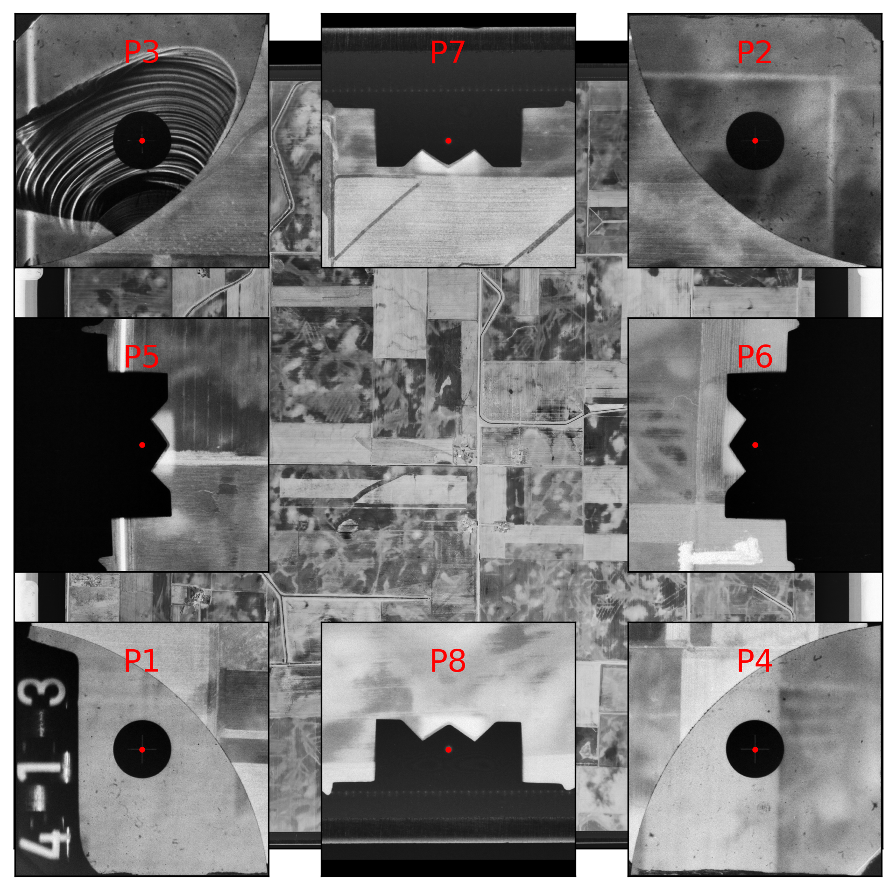

|br|

**Marker Separation (n = 60 reports)**

+-----------+-----------------+----------+
| markers   | mean            |   median |
+===========+=================+==========+
| P5 - P6   | 225.991 ± 0.024 |  225.992 |
+-----------+-----------------+----------+
| P7 - P8   | 225.993 ± 0.028 |  225.995 |
+-----------+-----------------+----------+
| P1 - P2   | 294.470 ± 0.735 |  294.101 |
+-----------+-----------------+----------+
| P3 - P4   | 294.461 ± 0.713 |  294.112 |
+-----------+-----------------+----------+

**Marker Location (n = 20 reports)**

+--------+-----------------+-----------------+---------+
| name   | x               | y               |   angle |
+========+=================+=================+=========+
| P1     | 8.800 ± 0.368   | 217.162 ± 0.326 | 224.99  |
+--------+-----------------+-----------------+---------+
| P2     | 217.161 ± 0.362 | 8.837 ± 0.332   |  45     |
+--------+-----------------+-----------------+---------+
| P3     | 8.815 ± 0.343   | 8.797 ± 0.365   | 134.996 |
+--------+-----------------+-----------------+---------+
| P4     | 217.136 ± 0.324 | 217.162 ± 0.326 | 314.992 |
+--------+-----------------+-----------------+---------+
| P5     | 0.000 ± 0.015   | 112.993 ± 0.037 | 179.998 |
+--------+-----------------+-----------------+---------+
| P6     | 225.981 ± 0.018 | 112.996 ± 0.029 |   0     |
+--------+-----------------+-----------------+---------+
| P7     | 112.999 ± 0.033 | 0.000 ± 0.014   |  90.001 |
+--------+-----------------+-----------------+---------+
| P8     | 112.998 ± 0.038 | 225.983 ± 0.023 | 269.998 |
+--------+-----------------+-----------------+---------+

and a "fixed" style:

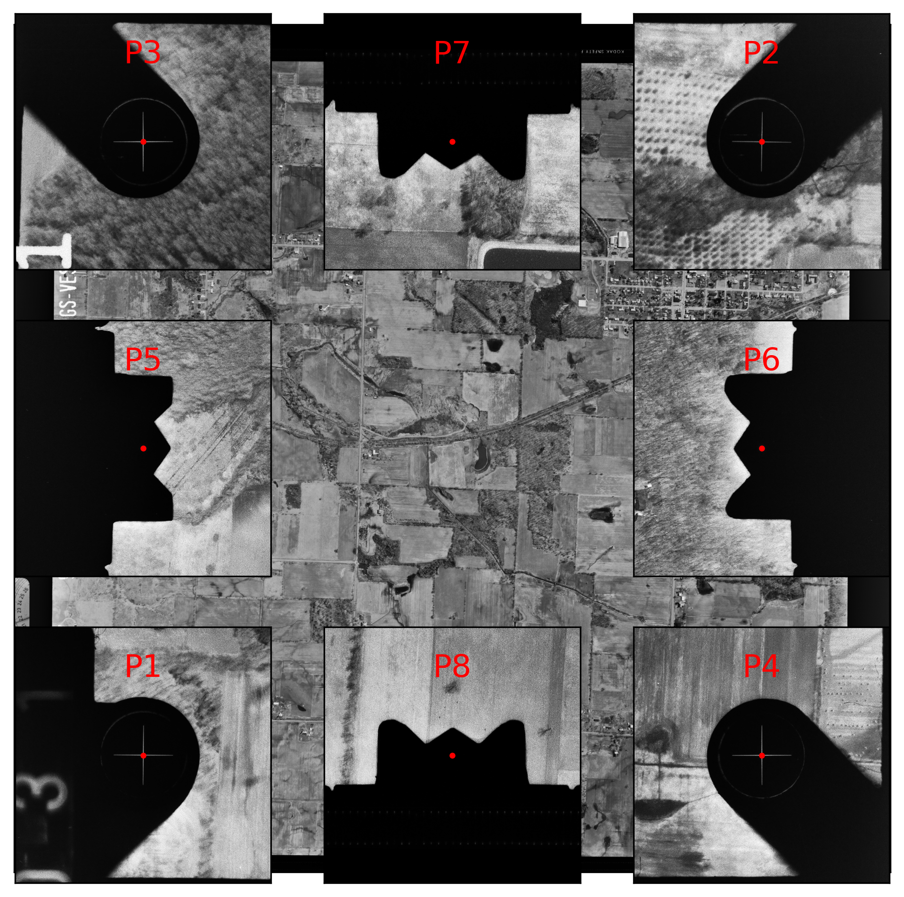

|br|

**Marker Separation (n = 41 reports)**

+-----------+-----------------+----------+
| markers   | mean            |   median |
+===========+=================+==========+
| P5 - P6   | 225.994 ± 0.016 |  225.995 |
+-----------+-----------------+----------+
| P7 - P8   | 225.993 ± 0.011 |  225.994 |
+-----------+-----------------+----------+
| P1 - P2   | 295.665 ± 4.064 |  294.018 |
+-----------+-----------------+----------+
| P3 - P4   | 295.702 ± 4.062 |  294.027 |
+-----------+-----------------+----------+

**Marker Location (n = 33 reports)**

+--------+-----------------+-----------------+---------+
| name   | x               | y               |   angle |
+========+=================+=================+=========+
| P1     | 8.471 ± 1.590   | 217.527 ± 1.588 | 225.001 |
+--------+-----------------+-----------------+---------+
| P2     | 217.521 ± 1.593 | 8.470 ± 1.592   |  45.001 |
+--------+-----------------+-----------------+---------+
| P3     | 8.464 ± 1.590   | 8.473 ± 1.593   | 135.002 |
+--------+-----------------+-----------------+---------+
| P4     | 217.528 ± 1.591 | 217.527 ± 1.588 | 315.001 |
+--------+-----------------+-----------------+---------+
| P5     | 0.000 ± 0.010   | 112.998 ± 0.013 | 179.999 |
+--------+-----------------+-----------------+---------+
| P6     | 225.992 ± 0.018 | 112.991 ± 0.012 |   0.004 |
+--------+-----------------+-----------------+---------+
| P7     | 112.993 ± 0.013 | 0.000 ± 0.012   |  90.002 |
+--------+-----------------+-----------------+---------+
| P8     | 113.002 ± 0.014 | 225.993 ± 0.009 | 270.003 |
+--------+-----------------+-----------------+---------+

.. note::

    The coordinates for P5-P8 above correspond to the center of the small dot near the tip of the fiducial marker.

references
----------

.. [1] Fleming EA (1960) Recognition of Air Survey Lens Types. *The Canadian Surveyor* 15(**2**), 91–96.
             doi: `10.1139/tcs-1960-0027 <https://doi.org/10.1139/tcs-1960-0027>`__.

.. [2] In a number of the calibration reports for these "modified" cameras, the phrase "... which has been modified to
       meet the requirements of a precision camera" is included. Presumably, this modification is adding fiducial
       markers, which might explain why this camera type corresponds to so many different fiducial marker patterns.
