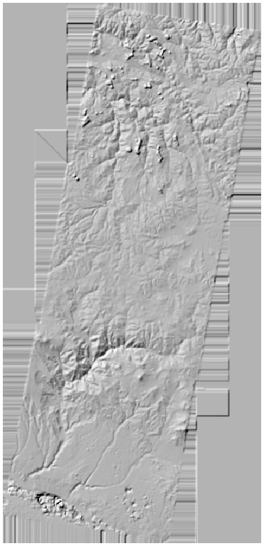
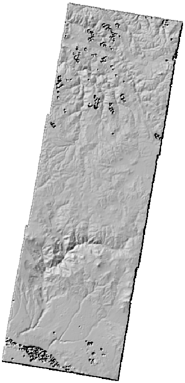

computing the absolute orthophoto and DEM
=========================================

Once you have successfully run :py:meth:`spymicmac.register.register_relative`, you will have an absolute orientation
folder, ``Ori-TerrainFinal``. This is the folder to pass to ``Malt``:

.. code-block:: sh

    mm3d Malt Ortho "OIS.*tif" TerrainFinal DirMEC=MEC-Malt NbVI=2 ZoomF=1 DefCor=0 CostTrans=4 EZA=1 SzW=3 Regul=0.1

or, using :py:meth:`spymicmac.micmac.malt`:

.. code-block:: python

    from spymicmac import micmac
    micmac.malt('OIS.*tif', 'TerrainFinal',
        zoomf=1,
        dirmec='MEC-Malt',
        cost_trans=4,
        szw=3,
        regul=0.1
    )

Just like with the :doc:`../relative/malt` step, once this command finishes, you will have two new directories:
``MEC-Malt`` and ``Ortho-MEC-Malt``. The DEM and associated correlation masks are found in ``MEC-Malt``, while the
orthophotos are found in ``Ortho-MEC-Malt``.

Also like with the relative step, the other parameters used here are:

- **NbVI** (number of visible images): ``Malt`` defaults to only running where 3 or more images are visible
  (``NbVI=3``), but it is usually fine to go with 2 images.
- **ZoomF** (final zoom level): here, we want to process the DEM at full resolution (``ZoomF=1``).
- **DefCor** (default correlation value): the default correlation value to use in pixels that are uncorrelated.
- **CostTrans** (transition cost): the cost to transition from correlation to decorrelation. Higher values means that
  more areas are included (because it is 'harder' to transition to decorrelation), though it may also increase the
  noise in the final result.
- **EZA** (export Z absolute): ``EZA=1`` argument ensures that the values in the DEM are absolute (in the units of
  the coordinate system), rather than scaled.
- **SzW** (correlation window size): the half-size of the window of the correlation window. ``SzW=3`` means using a
  7x7 correlation window; larger window sizes increase the likelihood of finding matches in areas with poor contrast
  (i.e., over glaciers), but also tend to smooth out the elevation.
- **Regul** (regularization factor): the regularization factor (penalty) to use for the transition term. Higher values
  tend to smooth out the terrain.

Depending on your images and application, you may want to experiment with parameters such as ``SzW`` and ``Regul``.

creating the orthomosaic using Tawny
------------------------------------
Just like with the :doc:`../relative/malt` step, the orthoimages are not mosaicked - they are just the individual images
orthorectified using the extracted DEM - you'll need to run ``Tawny`` again to mosaic the images:

.. code-block:: sh

    mm3d Tawny Ortho-MEC-Malt Out=Orthophotomosaic.tif RadiomEgal=0

Again, we are using ``RadiomEgal=0`` to use the images as-is, rather than attempting to balance the radiometry (as this
can lead to undesirable results).

Finally, you might need to re-combine the image tiles, depending on how large they are:

.. code-block:: sh

    mosaic_micmac_tiles Orthophotomosaic -imgdir Ortho-MEC-Malt

At this point, you should have a finished DEM and orthomosaic. You may want to check the accuracy of your DEM by
co-registering it to a DEM of known quality. You may also wish to remove residual
`doming effects <https://doi.org/10.5194/isprs-annals-V-3-2020-375-2020>`_ using ``mm3d PostProc Banana``,
or :py:meth:`spymicmac.micmac.banana`.

post-processing
---------------

After ``Malt`` is finished, the DEM will look something like this:

|br| The areas outside of the images are interpolated to fill the space, as are areas covered by the images that did
not correlate (due to clouds, shadow, water, or snow, for example). While the images are in ``.tif`` format, they are
not geotiffs (meaning that the georeferencing is not encoded in the image).

To mask areas outside of the images and add the georeferencing information to the image files, you can run
:py:meth:`spymicmac.mimcac.post_process`:

.. code-block:: python

    from spymicmac import micmac
    micmac.post_process('epsg:32719', 'KH9MC_19780516', 'MEC-Malt')

This will apply the ``AutoMask`` files to the DEM and georeference the DEM, correlation image, and create a hillshade.
The DEM should now look something like this:

|br| If you have used ``Tawny`` to create an orthomosaic, you can use ``do_ortho=True`` to georeference and mask the
orthomosaic. If you also want to mask the individual orthophotos, you can use ``ind_ortho=True``.

running malt on blocks of images (TODO)
----------------------------------------

If you have divided your study area into smaller sub-blocks of images, you will probably want to run ``Malt`` on each
of those sub-blocks individually, rather than trying to run it on all of the images at once.

