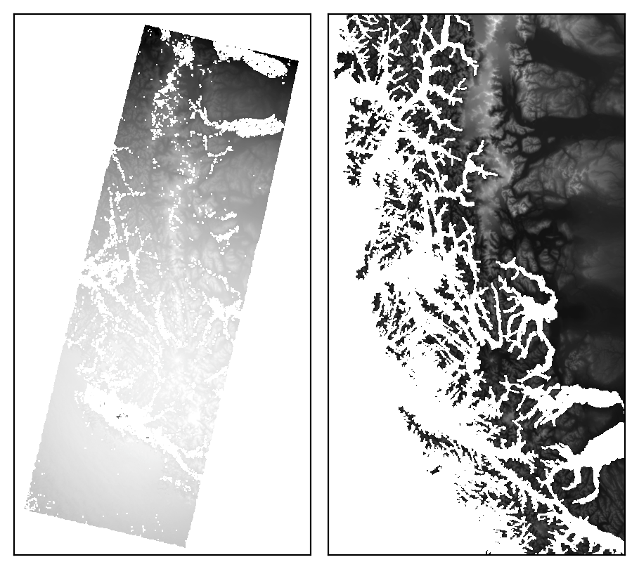
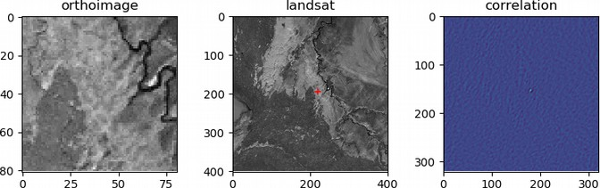
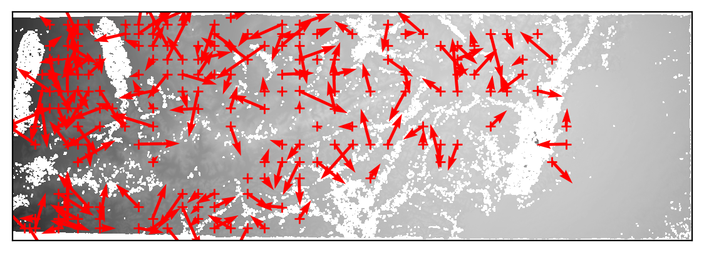
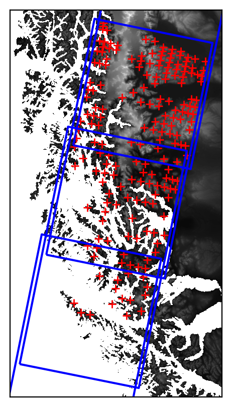
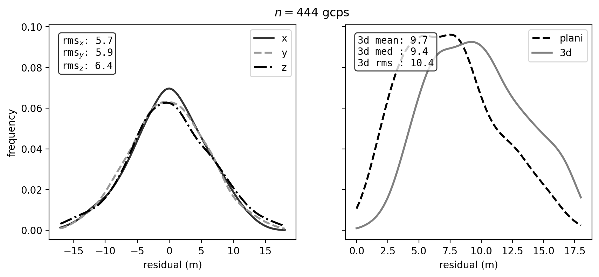
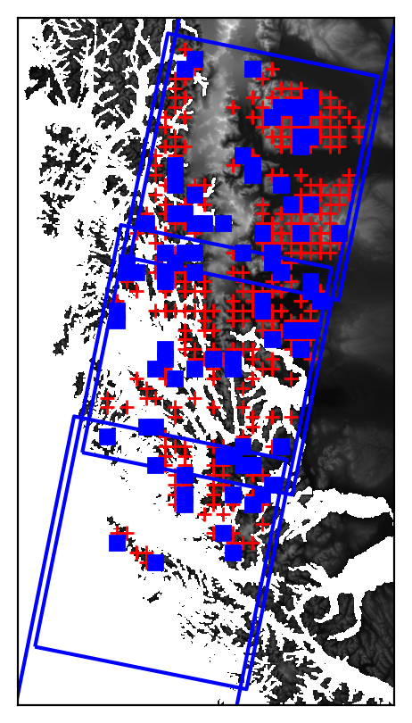
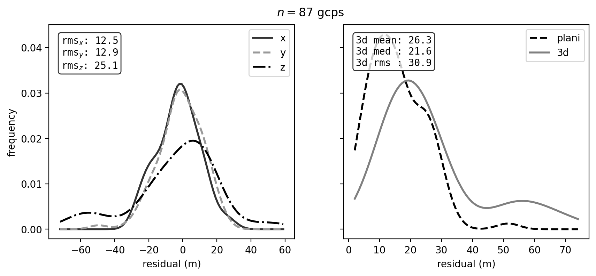
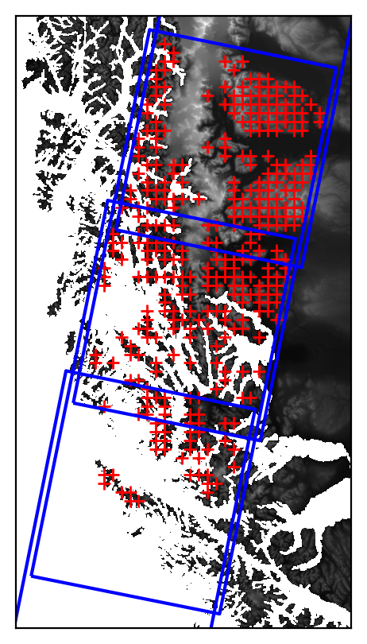
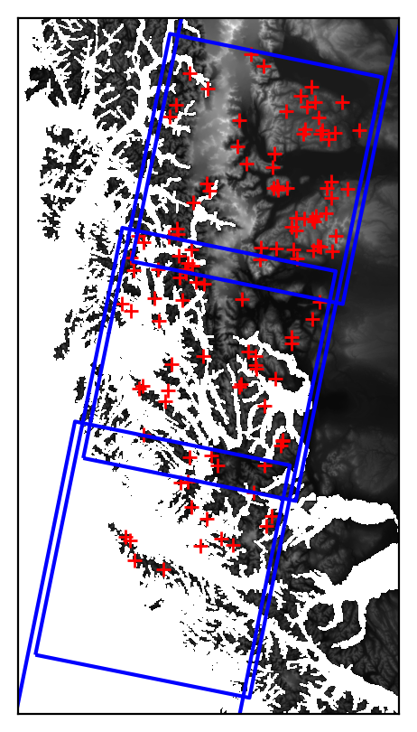

automatically finding control points
====================================
At this point, you should have successfully run ``mm3d Malt`` and ``mm3d Tawny`` to generate a relative orthophoto
and DEM. You should also have run :py:meth:`spymicmac.micmac.mosaic_micmac_tiles` (or
:doc:`../../spymicmac/scripts/mosaic_micmac_tiles`) if needed - otherwise, :py:meth:`spymicmac.register.register_relative`
(or :doc:`../../spymicmac/scripts/register_relative`) will most likely fail.

In order to run :py:meth:`spymicmac.register.register_relative`, you will need a number of files, detailed in the section
below. After that, this document will describe the process that :py:meth:`spymicmac.register.register_relative`
uses to find GCPs and iteratively refine the orientation.

necessary files
----------------

reference orthoimage and DEM
^^^^^^^^^^^^^^^^^^^^^^^^^^^^^^
At the risk of stating the obvious, the reference orthoimage and DEM should cover your study area. The reference
orthoimage can be a high-resolution orthomosaic, or it can be a comparatively low-resolution satellite image.
:py:meth:`spymicmac.register.register_relative` has been tested on both Landsat-8 and Sentinel-2 images, with
satisfactory results for both.

In general, the results will depend in part on the accuracy of the control points - so if your reference orthoimage
is highly accurate and of a similar resolution to your air photos, the more accurate the result will be.

Similar rules apply for the reference DEM - the more accurate the DEM, the better the final result.

image footprints
^^^^^^^^^^^^^^^^^^
This should be a vector dataset (e.g., shapefile, geopackage - anything that can be read by
`geopandas.read_file <https://geopandas.org/docs/reference/api/geopandas.read_file.html>`_). The footprints do not have
to be highly accurate - most of the routines in :py:meth:`spymicmac.register` have been developed using USGS
datasets/metadata, which are only approximate footprints.

The main use for the footprints in :py:meth:`spymicmac.register.register_relative` is in the call to
:py:meth:`spymicmac.orientation.transform_centers`, which uses
`RANSAC <https://scikit-image.org/docs/dev/api/skimage.measure.html#skimage.measure.ransac>`_
to estimate an affine transformation between the footprint centroids and the relative camera centers estimated
by ``mm3d Tapas``.

As long as the distribution of the footprints/centroids is approximately correct, this step
should work according to plan.

.. note::
    Some `USGS Aerial Photo Single Frames <https://doi.org/10.5066/F7610XKM>`_ (as well as the KH-9 Hexagon images)
    have footprints that are incorrectly placed, or the images have been scanned but not georeferenced. In this
    case, you may need to create your own footprints. It is most likely worth checking the metadata for these images
    before you start working.

exclusion and inclusion masks (optional)
^^^^^^^^^^^^^^^^^^^^^^^^^^^^^^^^^^^^^^^^^
Finally, in areas with lots of water or terrain that has changed substantially (e.g., glaciers),
:py:meth:`spymicmac.register.register_relative` can use both exclusion and inclusion masks to avoid searching for
matches on unstable terrain. Just like with the footprints, these files should be any data format that can be
read by `geopandas.read_file <https://geopandas.org/docs/reference/api/geopandas.read_file.html>`_.

The **exclusion** mask should be polygons of glaciers, landslides, or other terrain that should be *excluded* from
the search. Areas covered by this mask will be excluded from the search.

The **inclusion** mask should be polygons of land - any terrain that should be *included* in the search. Areas that
are not covered by this mask will be excluded from the search.

relative to absolute transformation
------------------------------------
The first step in :py:meth:`spymicmac.register.register_relative` to use :py:meth:`spymicmac.orientation.transform_centers`
to transform between the relative and absolute spaces, using the centroids of the footprint polygons and the camera
positions estimated by ``mm3d Tapas``.

The initial transformation is plotted for review:

|br| and the relative image, re-projected to the extent and CRS of the reference image, is also saved for checking.

Because the footprints are most likely approximate, especially for historic datasets, this step uses
`RANSAC <https://scikit-image.org/docs/dev/api/skimage.measure.html#skimage.measure.ransac>`_ with a fairly large
residual threshold. The goal is to create a rough transformation of the relative orthophoto that can be used for
the gridded template matching step.

template matching
------------------

Once the relative orthophoto has been roughly transformed to absolute space,
:py:meth:`spymicmac.register.register_relative` finds matches between the orthophoto and the reference image using
:py:meth:`spymicmac.matching.find_grid_matches`. The size of each template is 121x121 pixels, while the size of the
search window is set by ``dstwin``.

Each template and search image are first run through :py:meth:`spymicmac.image.highpass_filter`, to help minimize
radiometric differences between the two images (and maximizing the high-frequency variation). After that, the
template and search image are passed to `OpenCV matchTemplate <https://docs.opencv.org/4.5.2/d4/dc6/tutorial_py_template_matching.html>`_,
and the best match is found using normalized cross-correlation.

The correlation value of each potential match is then compared to the standard deviation of all of the correlation
values from the search image. This value (``z_corr``) is then used to filter out poor matches later on, as higher
quality matches are more likely to represent larger departures from the background correlation value:

iterative outlier removal
--------------------------

After the potential matches are found, a number of filtering steps are used to refine the results. First, any matches
where the DEM does not have a value are removed. Then, an affine transformation between the relative orthoimage
and reference orthoimage locations is estimated using RANSAC, to help remove obvious blunders.

Next, `mm3d GCPBascule <https://micmac.ensg.eu/index.php/GCPBascule>`_ is called, which transforms the camera locations
to the absolute space. The residuals for each GCP are then calculated, and outliers more than 3 normalized median
absolute deviations (NMAD) from the median residual value are discarded, and ``mm3d GCPBascule`` is called again.

This is followed by a call to `mm3d Campari <https://micmac.ensg.eu/index.php/Campari>`_ using
:py:meth:`spymicmac.micmac.campari`, and again residuals more than 3 NMAD from the median residual value are discarded.

After this, this process (``mm3d GCPBascule`` -> ``mm3d Campari`` -> outlier removal) is run up to 5 more times,
until there are no further outliers found.

final result
-------------

Once the outliers have been removed, the final GCP locations are stored in a number of files:

- auto_gcps/AutoGCPs.xml
- auto_gcps/AutoGCPs.txt
- auto_gcps/AutoGCPs.shp (+ other files)
- AutoMeasures.xml -- the GCP locations in each of the individual images

The final location of the GCPs is shown in both the relative image space:

|br| as well as the absolute space:

|br| And, the distribution of residuals is plotted for each of the x, y, and z dimensions, as well as the planimetric
and three-dimensional residuals:

|br| If there are still problematic GCPs, you can manually delete them from ``AutoMeasures.xml`` and re-run
``mm3d GCPBascule`` and ``mm3d Campari``.

The next step will be to run `mm3d Malt <https://micmac.ensg.eu/index.php/Malt>`_ using the ``Ori-TerrainFirstPass``
directory, to produce the absolute orthophoto and DEM.

using check points
------------------

To evaluate the results of the registration and bundle block adjustment, you can also use check points
(``use_cps=True``). This will randomly select a proprotion of the initial match points (``cp_frac=0.2``), and evaluate
the residuals of these check points after the iterative bundle block adjustment is finished.

Check points are plotted as blue squares in the GCP location plots:

|br| As with the GCPs, the distribution of residuals is also plotted:

|br| Note that because the check points are randomly selected from the initial matches, it is possible that there will
be large residuals due to spurious matches or other issues with the points.

search strategies
------------------

Five different strategies for template matching are available:

- regular grid (``strategy='grid'``) - a regular grid of points, spaced by ``density`` pixels (default value: 200),
  is used to register the relative image to the reference image. This is the default option.
- random points (``strategy='random'``) - potential points are generated randomly throughout the image. In this case,
  ``density`` is the approximate total number of points desired, rather than the spacing.
- `Chebyshev <https://en.wikipedia.org/wiki/Chebyshev_nodes>`__ nodes (``strategy='chebyshev'``). A grid is generated
  by using the formula for the :math:`n` Chebyshev nodes of the second kind, where :math:`n` is calculated for each
  image dimension by dividing the dimension by ``density`` and taking the integer value. This has the benefit of
  increasing the density of search points at the border of the image domain and decreasing the density in the center,
  which can help to lessen the effects of doming in the bundle block adjustment.
- manually identified points (``fn_gcps``) - template matching is performed using the point locations passed through
  either a CSV or shapefile/geopackage.
- orb (``use_orb=True``) - potential points are identified within a grid (spaced by ``density`` pixels) using
  `skimage.feature.ORB <https://scikit-image.org/docs/stable/api/skimage.feature.html#skimage.feature.ORB>`__. This
  has the benefit of selecting clear/obvious features, though it may also be more time intensive owing to the higher
  number of potential matches generated.

The plots below illustrate the difference in distributions between the regular grid (left), random points (center),
and chebyshev (right) strategies, run using the same initial parameters:

|br| With the chebyshev strategy, the GCPs are more dense along the edges of the image overlap, and less densely spaced
towards the middle of the overlapping area.
