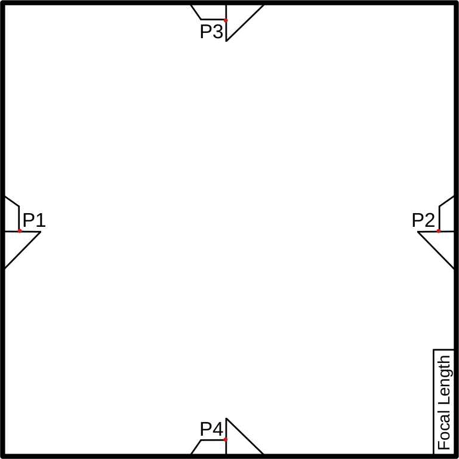
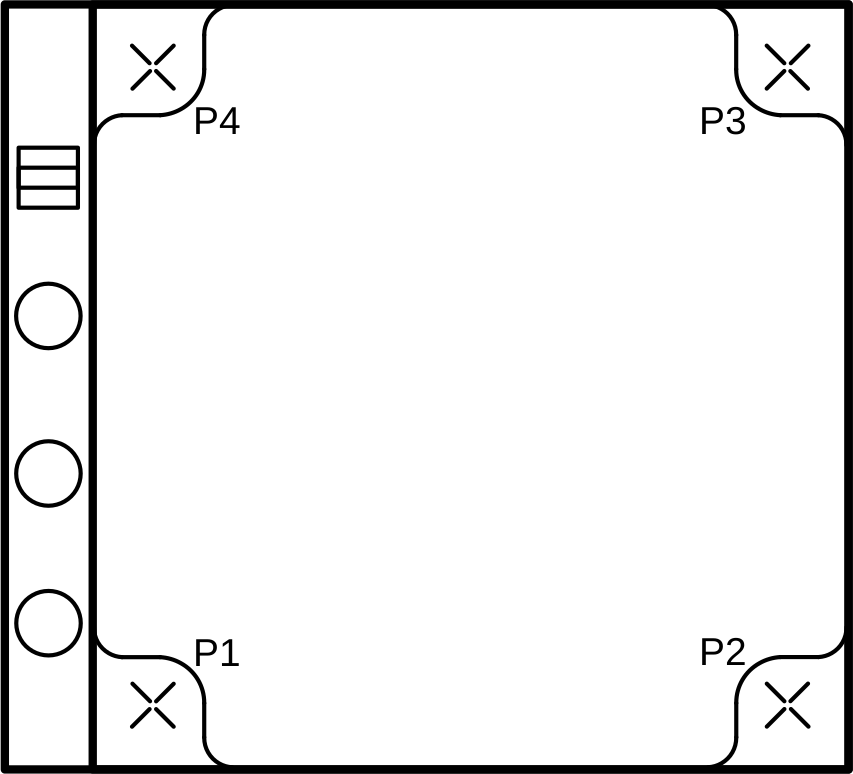
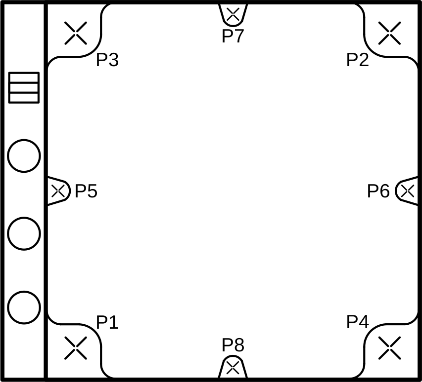
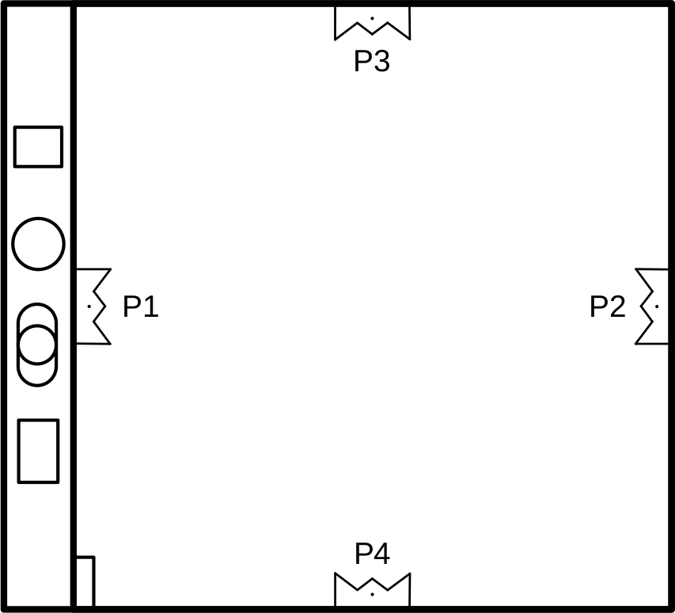

Example Camera Models
=======================

This section is a list of different camera models that have acquired historical aerial photos, what their fiducial marks
look like, and the approximate coordinates of the fiducial marks that you can use to populate the ``MeasuresCamera.xml`` file.

.. note::

    If you have a calibration report that corresponds to your specific images, **you should use that instead**.
    The information provided here is for those cases where a calibration report does not exist, or has been lost to time.

Fairchild F224, K17B (Metrogon Lens)
------------------------------------

+----+-----+-----+
|    | x   | y   |
+----+-----+-----+
| P1 | 1   | 113 |
+----+-----+-----+
| P2 | 225 | 113 |
+----+-----+-----+
| P3 | 113 | 1   |
+----+-----+-----+
| P4 | 225 | 113 |
+----+-----+-----+

.. note::

    These are the approximate coordinates for the corners of the fiducial marker, as these tend to be more stable
    than the tips of the "wings"

Wild RC5, RC8 (Aviogon Lens)
=============================

+----+-----+-----+
|    | x   | y   |
+----+-----+-----+
| P1 | 212 | 0   |
+----+-----+-----+
| P2 | 212 | 212 |
+----+-----+-----+
| P3 | 0   | 212 |
+----+-----+-----+
| P4 | 0   | 0   |
+----+-----+-----+

Wild RC10 (Aviogon Lens)
=========================

+----+-----+-----+
|    | x   | y   |
+----+-----+-----+
| P1 | 4   | 216 |
+----+-----+-----+
| P2 | 216 | 4   |
+----+-----+-----+
| P3 | 4   | 4   |
+----+-----+-----+
| P4 | 216 | 216 |
+----+-----+-----+
| P5 | 0   | 110 |
+----+-----+-----+
| P6 | 220 | 110 |
+----+-----+-----+
| P7 | 110 | 0   |
+----+-----+-----+
| P8 | 110 | 220 |
+----+-----+-----+

Zeiss RMK (Pleogon Lens)
=========================

+----+-----+-----+
|    | x   | y   |
+----+-----+-----+
| P1 | 1   | 113 |
+----+-----+-----+
| P2 | 226 | 113 |
+----+-----+-----+
| P3 | 113 | 0   |
+----+-----+-----+
| P4 | 113 | 226 |
+----+-----+-----+

.. note::

    The coordinates above correspond to the center of the small dot near the tip of the fiducial marker.