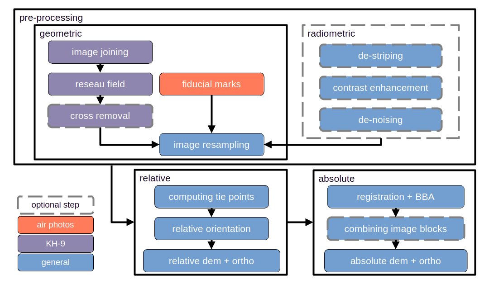

Tutorials
=======================

Here, you will find information about the workflow for using spymicmac to process KH-9 and historic air photos.

|br|

.. toctree::
   :glob:
   :maxdepth: 2

   tealdeer
   preprocessing/index
   micmac_processing/index

