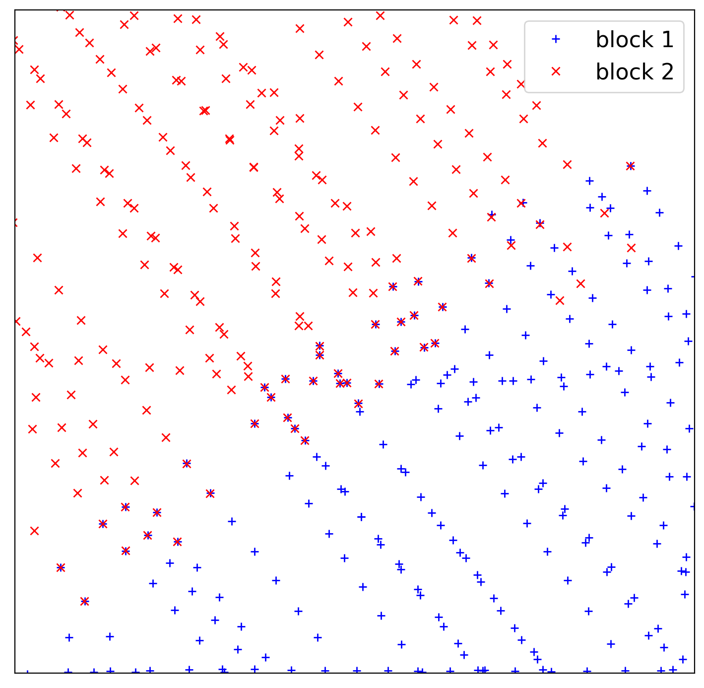
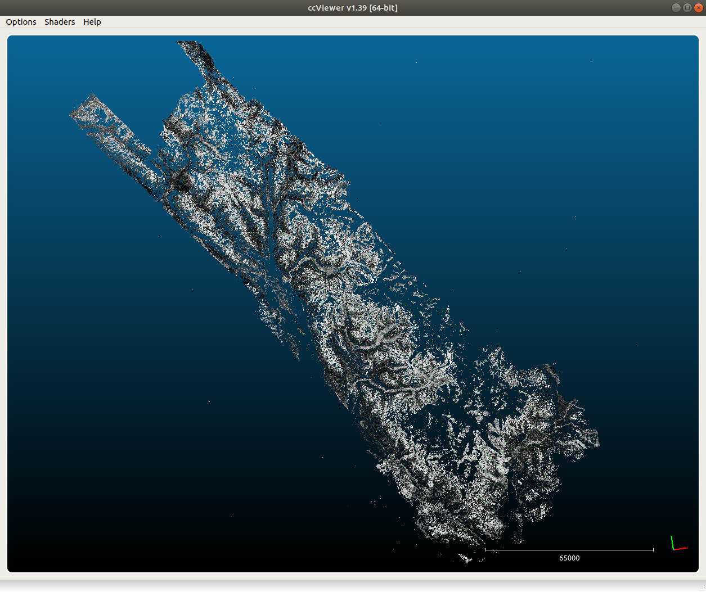

combining image blocks
=======================

.. note::

    For "small" (<500) numbers of images, you can usually run all of the processing steps using all of the images. With
    more and more images, however, it can be advantageous to divide the images into sub-blocks.

    The :doc:`tapas` step should be run with all of the images, in order to get the best possible relative orientation,
    especially when working with areas with poor tie point coverage (for example, large glaciers or ice fields).

If you divide the study area into smaller sub-blocks, you should run the previous steps (:doc:`relative`, :doc:`register`)
on each sub-block individually. Unfortunately, this can often lead to issues in the areas where the blocks overlap,
as seen below.

|br| The image below shows camera centers for two different sub-blocks - note the different calculated camera
positions in the overlapping area - when the absolute DEMs and Orthophotos are created using ``Malt``, this difference
will make combining the DEMs and Orthophotos more difficult.

To prevent this issue, :py:meth:`spymicmac.orientation.combine_block_measures` will combine the individual GCP and
Measures files for each block, so that ``Campari`` can be used to create a single absolute orientation for all of the
images. You can also run :py:meth:`spymicmac.micmac.iterate_campari` to iteratively run ``Campari``, removing any
outlier GCPs to further refine/correct the orientation.

Or, you can use :py:meth:`spymicmac.orientation.block_orientation` or the corresponding command-line tool
:doc:`../../spymicmac/scripts/block_orientation` to combine the steps of both.

The screenshot below shows the point cloud file for a set of 1455 historic images acquired over the Juneau Icefield.

|br| The images were divided into 4 overlapping blocks of roughly equal size for the :doc:`relative` and :doc:`register`
steps, before being re-combined into a single orientation used to extract DEMs and Orthophotos. This has resulted in
relatively smooth overlaps between the different DEM blocks, as illustrated in the image below:
