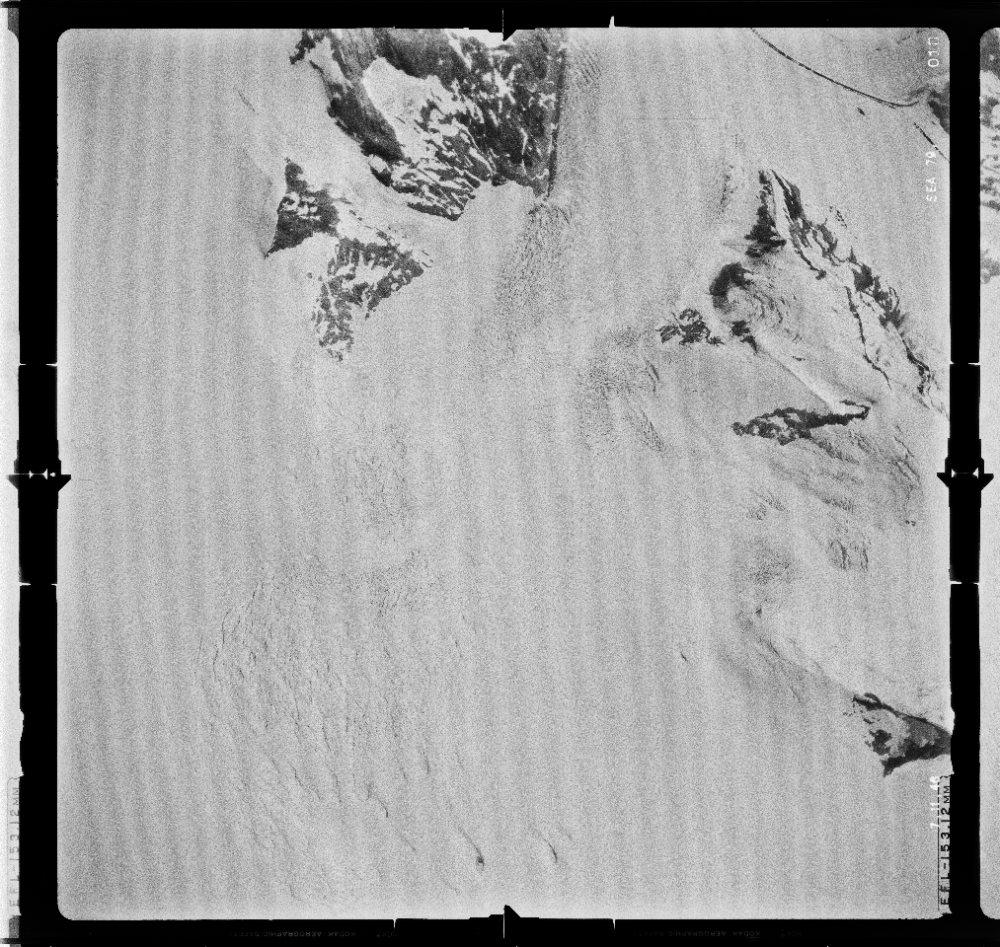
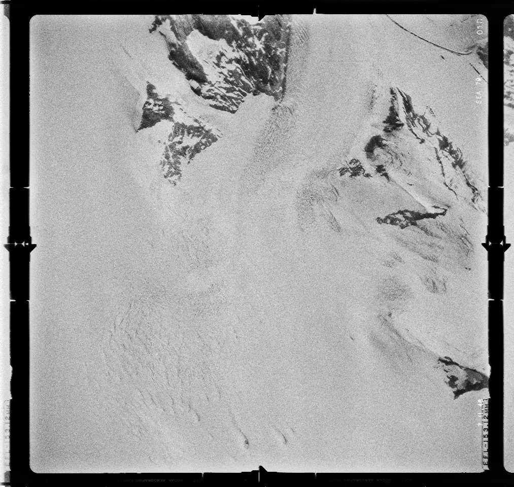
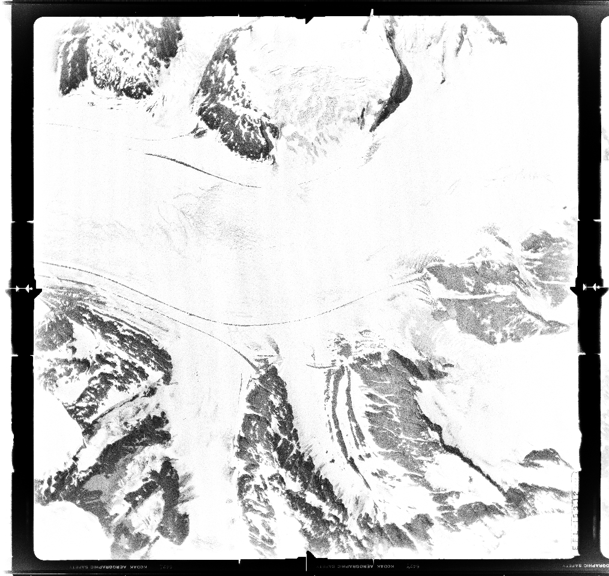
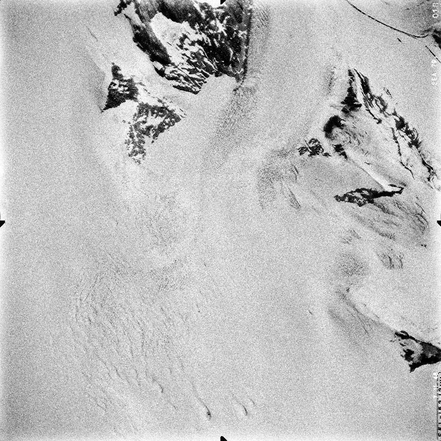
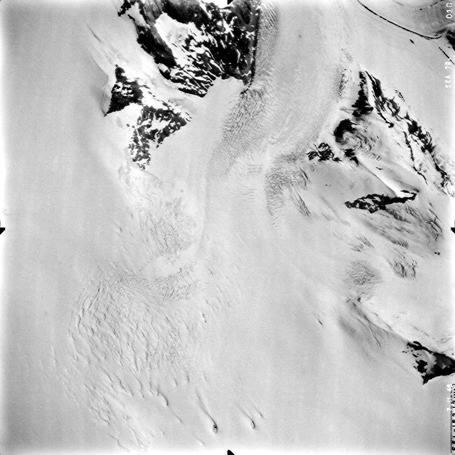

historic air photo preprocessing
=================================

It may be worthwhile to perform some different pre-processing steps on scanned historic air images. For example,
it can help remove artefacts or increase contrast in images, in order to help improve both the visual results, as well
as the correlation and DEM extraction.

image de-striping
------------------
Occasionally, scanned images will have artefacts, such as the prominent striping shown here:

|br|

The :py:meth:`spymicmac.image` function :py:meth:`spymicmac.image.remove_scanner_stripes`, based
on a technique described in [Crippen1989]_
(`pdf <https://www.asprs.org/wp-content/uploads/pers/1989journal/mar/1989_mar_327-331.pdf>`_), can be used to remove
these stripes - note the use of ``scan_axis=1`` to indicate a scan from left to right, rather than top to bottom:

.. code-block:: python

    from spymicmac.image import remove_scanner_stripes
    filtered = remove_scanner_stripes(img, scan_axis=1)

The result shows a significant reduction in the striping:

|br|

.. _contrast-enhancement:

contrast enhancement
---------------------
Another common issue with scanned aerial images is that they can have inconsistent brightness between different
images:

|br| ``spymicmac`` has two main functions available for enhancing contrast: :py:meth:`spymicmac.image.stretch_image`
and :py:meth:`spymicmac.image.contrast_enhance`.

``stretch_image()`` performs a linear contrast stretch on the image to a given quantile, while ``contrast_enhance()``
performs a median filter to de-noise, before calling ``stretch_image()`` and performing a gamma adjustment on the
stretched image.

For the image on the left above, here is the result of applying ``stretch_image()`` clipped to (0.01, 0.99) -
that is, 1% and 99% of the image values:

|br| And here is the result using ``contrast_enhance()`` (note that this also enhances the residual striping
that was not corrected earlier):

|br| Different images/surveys may require different levels of contrast enhancement - for example, it may not be
advisable to perform this kind of contrast enhancement on images that are mostly bright snow, as this will
primarily enhance noise in the image.

de-noising
-----------

In many cases, there may also be some noise in the images - this can be seen above, for example. One way to reduce
this noise is to use a `median filter <https://scikit-image.org/docs/dev/api/skimage.filters.html#skimage.filters.median>`_,
similar to what is done in :py:meth:`spymicmac.image.contrast_enhance`:

.. code-block:: python

    from skimage.filters import median
    from skimage.morphology import disk
    filtered = median(img, selem=disk(3))

Here, a smaller filter (max size 3x3) will help to remove the salt-and-pepper noise, while preserving most of the
features.

.. [Crippen1989] Crippen, R. E. (1989) "A simple spatial filtering routine for the cosmetic removal of scan-line noise
    from Landsat TM P-tape imagery." *Photogrammetric Engineering & Remote Sensing*, 55(3):327–31
