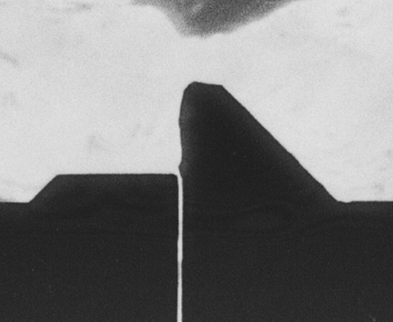
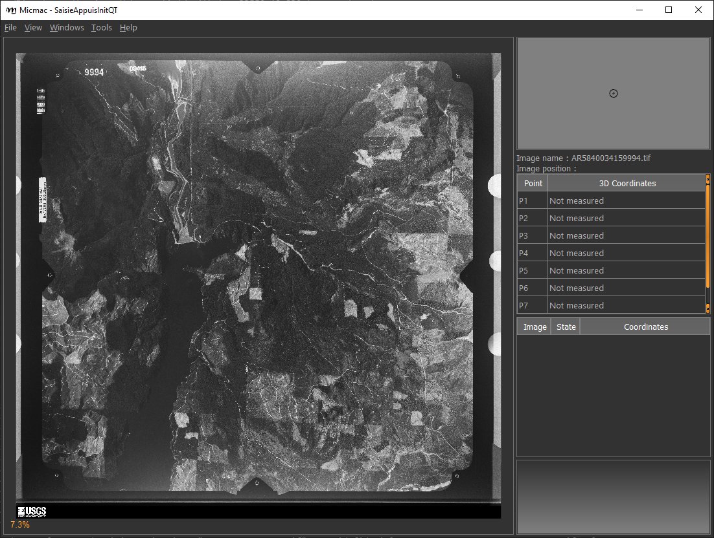

fiducial marks
==================

Once you have finished pre-processing the images, you need to resample them to a common geometry using
`mm3d ReSampFid <https://micmac.ensg.eu/index.php/ReSampFid>`_. For historical aerial images, follow the steps below to
find the fiducial markers for resampling.

SaisieAppuisInitQT
------------------
Depending on the camera setup, there will be between 4 and 8 (or more) fiducial markers. They may look like
a crosshairs:

|br| They may also be something like this:

|br| Or any number of other alternatives. To see examples of fiducial patterns for some common camera types, check
out :doc:`cameras`.

The MicMac program for inputting fiducial mark locations is ``SaisieAppuisInitQT``
(or just ``SaisieAppuisInit`` if you don't have the QT version set up). For each image, you'll need to run the following:

.. code-block:: text

    mm3d SaisieAppuisInitQT  NONE id_fiducial.txt MeasuresIm-.xml

This will open a window like the following:

|br| For each fiducial marker listed in ``id_fiducial.txt``, you'll need to zoom in on the marker, click
the name in the table on the right, and then click on the fiducial marker in the main window. If necessary, you can
also move the marker once you've placed it (because we all make mistakes).

.. note::

    ``id_fiducial.txt`` is a simple text file with the 'name' of each fiducial mark listed on each line. The names
    of the fiducial markers in ``id_fiducial.txt`` should match the names in ``MeasuresCamera.xml``.

    See :download:`here <../../../examples/id_fiducial.txt>` for an example.

Once you have selected the location for each fiducial marker, select ``File > Exit`` to save the point locations to
``MeasuresIm-.xml``.

Note that this will actually create two files, ``MeasuresIm--S2D.xml`` and ``MeasuresIm--S3D.xml``. As these
are only two-dimensional points, you can discard the ``S3D.xml`` file. You'll need to move the ``S2D.xml`` file to a
new folder, ``Ori-InterneScan``, and rename it to remove the ``-S2D`` part of the name. In other words:

.. code-block:: sh

    rm MeasuresIm-AR5840034159994.tif-S3D.xml
    mkdir Ori-InterneScan
    mv MeasuresIm-AR5840034159994.tif-S2D.xml Ori-InterneScan/MeasuresIm-AR5840034159994.tif.xml

You can also use the shell script ``move_fiducial_xml.sh``, which will do this for any file matching the pattern
``MeasuresIm*S2D.xml``.

Kugelhupf
----------
If you have a number of images, and the fiducial marks are in approximately the same place,
you might want to give ``mm3d Kugelhupf`` a try:

.. code-block:: text

    Kugelhupf (Klics Ubuesques Grandement Evites, Lent, Hasardeux mais Utilisable pour Points Fiduciaux): Automatic fiducial point determination
    *****************************
    *  Help for Elise Arg main  *
    *****************************
    Mandatory unnamed args :
      * string :: {Pattern of scanned images}
      * string :: {2d fiducial points of an image}
    Named args :
      * [Name=TargetHalfSize] INT :: {Target half size in pixels (Def=64)}
      * [Name=SearchIncertitude] INT :: {Search incertitude in pixels (Def=5)}
      * [Name=SearchStep] REAL :: {Search step in pixels (Def=0.5)}
      * [Name=Threshold] REAL :: {Limit to accept a correlation (Def=0.90)}

As an example:

.. code-block:: sh

    mm3d Kugelhupf AR5840034159994.tif Ori-InterneScan/MeasuresIm-AR5840034159994.tif.xml

This command will take the locations from the MeasuresIm file specified by the second argument and search any of the
remaining images using template matching, to try to find their locations automatically.

Note that it does not always work, especially for images where the fiducial mark is a dot rather than a crosshair or
target.

Once you have all of the image points, you can move on to the next step: re-sampling the images using ``ReSampFid``.
