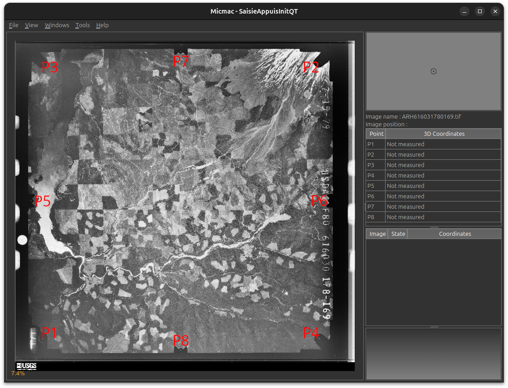
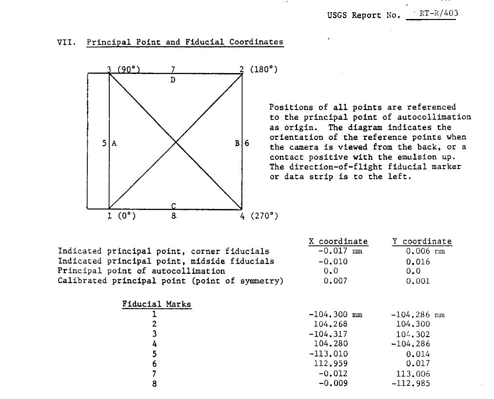
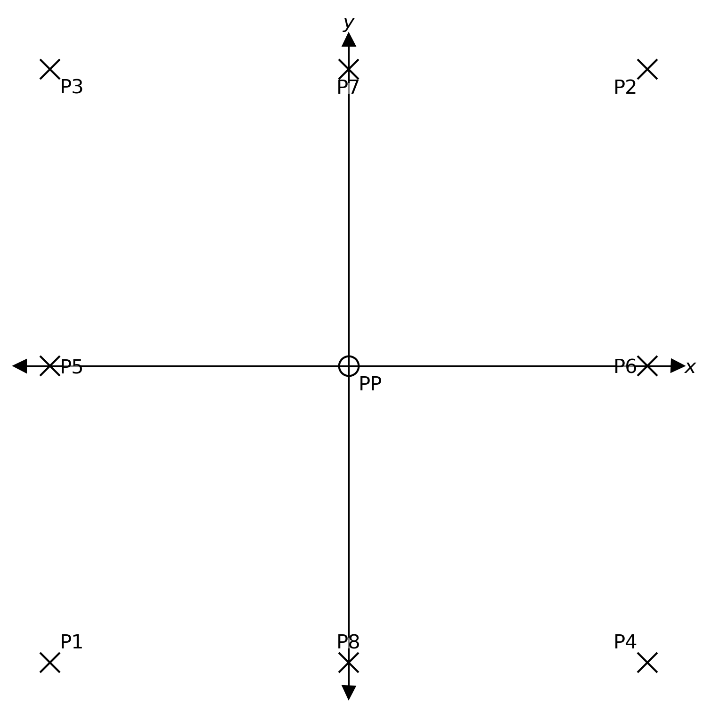
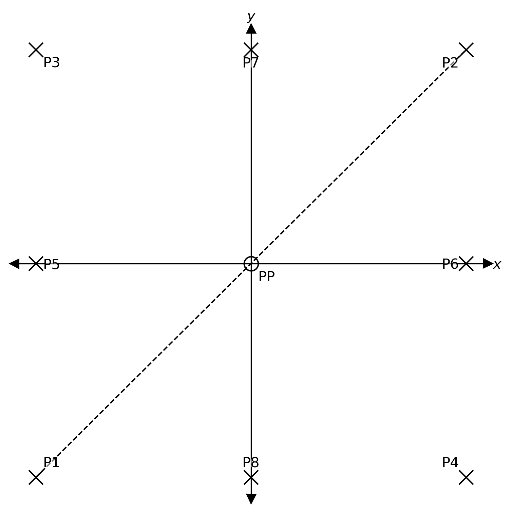
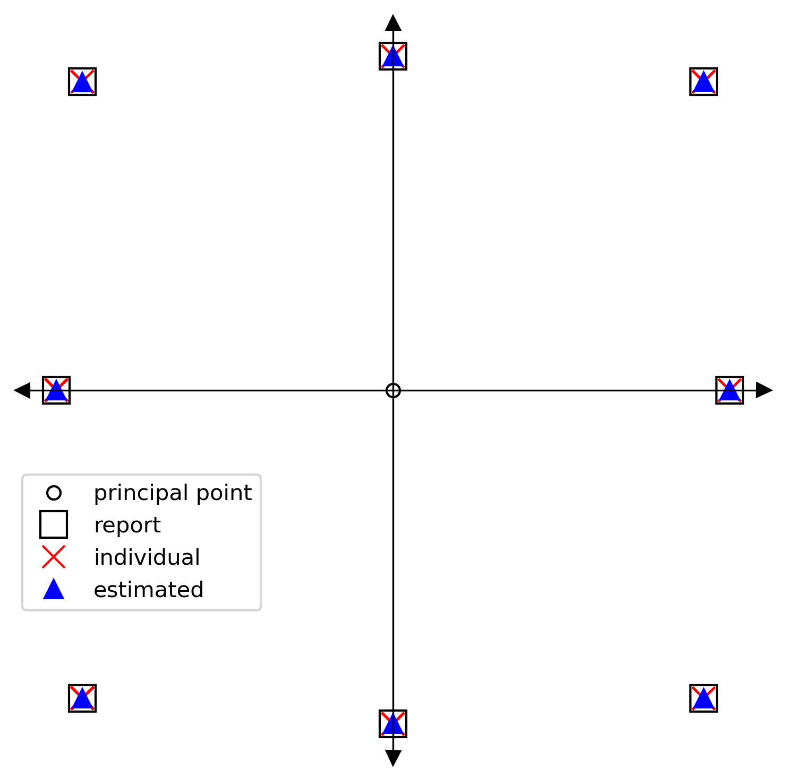

estimating camera measures
==========================

You will likely run into cases where you cannot use the given fiducial markers and/or the calibration report in order
to resample the images. This might be because:

- the fiducial markers are obscured or otherwise cut off in the scans;
- the fiducial markers are ambiguous;
- the calibration report has been lost to time, or you otherwise do not have a calibration report.

In these cases, you can use a combination of :py:mod:`spymicmac.matching`, :py:meth:`spymicmac.micmac.batch_saisie_fids`
and :py:meth:`spymicmac.micmac.estimate_measures_camera` to generate a ``MeasuresCamera.xml`` file with the fiducial
marker locations.

identifying fiducial markers
----------------------------

.. important::

    When you are inputting fiducial marker locations using :py:meth:`spymicmac.micmac.batch_saisie_fids`,
    **make sure your image orientation is consistent!**

    Scans will sometimes have the images rotated, but not consistently. For example, this image, which has the
    data strip on the right side, whereas most of the others have the data strip on the left:

    .. image:: img/rotated.png
        :width: 600
        :align: center
        :alt: an aerial photograph, with the image rotated 180°

    Most calibration reports will give the fiducial marker locations with the assumption that the data strip is
    on the left-hand side of the image, but be sure to check!

Create ``MeasuresIm`` files for a number of images - you don't necessarily need to use all of the images that you have
(but at the same time, you'll need to do this step anyway), but you should come up with a sufficient sample size to
be able to smooth over any differences due to difficulty identifying marks, or issues with film development or scanning.

worked example
---------------

To illustrate how this works, we're going to use an example for a set of images that does have a calibration
certificate:

|br| The calibration certificate for these images can be downloaded from the
`USGS Camera Calibration Reports Database <https://calval.cr.usgs.gov/cameracal/reports.html>`__ - this is Report
Number RT-R/403:

|br| Translating the coordinates from the report using :py:meth:`spymicmac.micmac.create_measures_xml`, we have the
following locations for our fiducial markers:

+------+---------+---------+
| name | x       | y       |
+======+=========+=========+
| P1   | 8.710   | 217.292 |
+------+---------+---------+
| P2   | 217.278 | 8.706   |
+------+---------+---------+
| P3   | 8.693   | 8.704   |
+------+---------+---------+
| P4   | 217.290 | 217.292 |
+------+---------+---------+
| P5   | 0.0     | 112.992 |
+------+---------+---------+
| P6   | 225.969 | 112.989 |
+------+---------+---------+
| P7   | 112.998 | 0.0     |
+------+---------+---------+
| P8   | 113.001 | 225.991 |
+------+---------+---------+

To be able to use :py:meth:`spymicmac.micmac.estimate_measures_camera`, we need the following information,
detailed/illustrated in the next sections:

- ``approx``: a ``DataFrame`` of approximate fiducial marker locations, or a dict of fiducial marker names and
  their angle with respect to the principal point;
- ``pairs``: a list of pairs of co-linear fiducial markers;

We also need to know the scanning resolution of the image **in meters**, to be able to convert from pixels to camera
geometry - for example, if the images are scanned at 25 microns (25 µm per pixel), the value of ``scan_res`` should be
``2.5e-5`` (:math:`2.5 \times 10^{-5}` m per pixel).

approximate measures
^^^^^^^^^^^^^^^^^^^^^

The following code will create a ``DataFrame`` with the approximate fiducial marker locations for the
camera illustrated above:

.. note::

    Note the convention here, with the *y* (``i``) axis starting with 0 at the top of the image, increasing to 1 at
    the bottom of the image.

.. code-block:: python

    approx = pd.DataFrame(data={'name': ['P1', 'P2', 'P3', 'P4', 'P5', 'P6', 'P7', 'P8'],
                                'j': [0, 1, 0, 1, 0, 1, 0.5, 0.5],
                                'i': [1, 0, 0, 1, 0.5, 0.5, 0, 1]}).set_index('name')

+------+-----+-----+
| name | x   | y   |
+======+=====+=====+
| P1   | 0   | 1   |
+------+-----+-----+
| P2   | 1   | 0   |
+------+-----+-----+
| P3   | 0   | 0   |
+------+-----+-----+
| P4   | 1   | 1   |
+------+-----+-----+
| P5   | 0   | 0.5 |
+------+-----+-----+
| P6   | 1   | 0.5 |
+------+-----+-----+
| P7   | 0.5 | 0   |
+------+-----+-----+
| P8   | 0.5 | 0   |
+------+-----+-----+

.. note::

    These values don't need to be exact - this is primarily used to align the locations measured for each image. Values
    of 0, 1 for corner fiducials and 0, 0.5, or 1 for mid-side fiducials should be sufficient.

Alternatively, we can pass a ``dict`` of name/value pairs with the fiducial marker names and the angle they make with
respect to the principal point and the *x*-axis.

Here, we're imagining that the principal point is the origin of a coordinate axis, with the *x*-axis increasing toward
the right, and the *y*-axis increasing towards the top of the image:

|br| Using the examples above, P1 makes an angle of 225° (or :math:`5\pi / 4`); P2 makes an angle of 45° (or :math:`\pi`/4),
P3 makes an angle of 135° (or :math:`3\pi / 4`), and so on:

.. code-block:: python

    angles = {'P1': 225, 'P2': 45, 'P3': 135, 'P4': 315,
              'P5': 180, 'P6': 0, 'P7': 90, 'P8': 270}

.. note::

    Angle values can be either given in degrees or radians.

collinear pairs
^^^^^^^^^^^^^^^^

Finally, we need a list of the collinear pairs - that is, the pairs of fiducial markers that are co-linear with the
principal point:

|br| In the example above, P1 and P2 are collinear, as the line connecting them passes through the principal point.
A list of each of the pairs of collinear markers would then be:

.. code-block:: python

    pairs = [('P1', 'P2'), ('P3', 'P4'),
             ('P5', 'P6'), ('P7', 'P8')]

scanning resolution
^^^^^^^^^^^^^^^^^^^^^

The last piece of information that we need is the scanning resolution, in m. If you happen to know this value (for
example, you know that the images were scanned at 25 micron resolution), then you can use this directly.

However, it is worth noting that the nominal/reported value is not necessarily the true value, and it is perhaps worth
calculating the distance between a pair of collinear markers (or several pairs). Using calibration reports for similar
cameras, you can then estimate the scanning resolution by dividing the expected distance in mm by the measured
distance in pixels.

checking the results
^^^^^^^^^^^^^^^^^^^^^

With these pieces in place, we can run :py:meth:`estimate_measures_camera <spymicmac.micmac.estimate_measures_camera>`.
This will read all of the ``MeasuresIm`` files in the given ``ori`` directory (e.g., ``InterneScan`` for
``Ori-InterneScan``), rotate the coordinates to match with the values given by ``approx``, and scale them with the
value given by ``scan_res``:

.. code-block:: python

    import pandas as pd
    from spymicmac import micmac

    approx = pd.DataFrame(data={'name': ['P1', 'P2', 'P3', 'P4', 'P5', 'P6', 'P7', 'P8'],
                                'j': [0, 1, 0, 1, 0, 1, 0.5, 0.5],
                                'i': [1, 0, 0, 1, 0.5, 0.5, 0, 1]}).set_index('name')

    pairs = [('P1', 'P2'), ('P3', 'P4'),
             ('P5', 'P6'), ('P7', 'P8')]

    micmac.estimate_measures_camera(
        approx,
        pairs,
        ori='InterneScan',
        scan_res=2.5e-5,
        how='mean', # choose between mean, median
        write_xml=True # if True, creates Ori-{ori}/MeasuresCamera.xml
        inverted=True # y-axis used for approx is inverted
    )

This will create two ``.csv`` files in the current directory:

- ``AverageMeasures.csv``, containing the average location calculated from each ``MeasuresIm`` file;
- ``AllMeasures.csv``, containing the (rotated) locations for each ``MeasuresIm`` file.

If ``write_xml`` is ``True``, this will also create ``Ori-{ori}/MeasuresCamera.xml``, which can be read by, for example,
``mm3d ReSamFid``.

To see how we've done, let's compare the results from this set of images with the calibration report:

|br| This looks rather good - on our diagram, the locations all align reasonably well. If we take the difference
between the values from the report, and the values estimated by
:py:meth:`estimate_measures_camera <spymicmac.micmac.estimate_measures_camera>`, we can see that the locations agree
to better than 0.04 mm:

+------+------------------+------------------+
| name | :math:`\Delta x` | :math:`\Delta y` |
+======+==================+==================+
| P1   | 0.0191           | -0.0312          |
+------+------------------+------------------+
| P2   | 0.0247           | -0.0198          |
+------+------------------+------------------+
| P3   | -0.0086          | -0.0200          |
+------+------------------+------------------+
| P4   | -0.0117          | -0.0152          |
+------+------------------+------------------+
| P5   | -0.0192          | 0.0064           |
+------+------------------+------------------+
| P6   | 0.0163           | 0.0046           |
+------+------------------+------------------+
| P7   | 0.0025           | 0.0041           |
+------+------------------+------------------+
| P8   | -0.0064          | 0.0305           |
+------+------------------+------------------+

While this doesn't replace the value of having a contemporary calibration report for a particular camera, this
hopefully provides a reasonable approximation to the correct camera geometry - especially for cases where the original
fiducial markers are either ambiguous or cut out of the scan.
