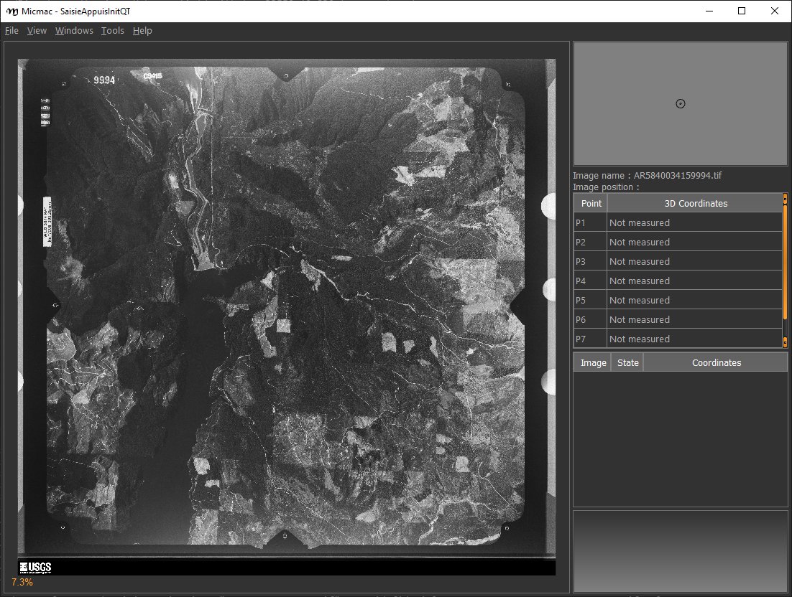

fiducial marks
==================

Before processing scanned aerial images, you need to resample them to a common geometry using
`mm3d ReSampFid <https://micmac.ensg.eu/index.php/ReSampFid>`_. The easiest way to do this is using the fiducial
markers which are usually visible around the frame of the image.

For historical aerial images, follow the steps below to find the fiducial markers for resampling.

spymicmac.matching
--------------------

There are a number of functions in :py:meth:`spymicmac.matching` that are designed to automatically locate fiducial
marker locations, given a ``MeasuresCamera.xml`` file and a template or camera type.

For matching generic cameras, use :py:meth:`spymicmac.matching.find_fiducials`. The required arguments are the image
filename and a **dict** object of (marker name, template) pairs.

If you have already located the fiducial markers in a single image using, for example, ``mm3d SaisieAppuisInitQT``,
you can use :py:meth:`spymicmac.matching.templates_from_meas` to generate this:

.. code-block:: python

    from spymicmac import matching
    from glob import glob

    templ_dict = matching.templates_from_meas(fn_img)
    imlist = glob('*.tif')

    for fn in imlist:
        matching.find_fiducials(fn, templ_dict)

This function also assumes that there is a ``MeasuresCamera.xml`` file located in ``Ori-InterneScan``; you can also
specify the file location using the ``fn_cam`` argument.

Additional keyword arguments to ``find_fiducials`` can be used to adjust the matching sensitivity or rotate the
``MeasuresCamera.xml`` locations if the image is rotated (for example, if the data strip should be on the left side of
the image but the image was scanned with the data strip along the top of the image).

:py:meth:`spymicmac.matching` also has a number of functions for matching specific camera/fiducial pattern types,
detailed in the following sections.

fairchild cameras
------------------

Matching Fairchild-style cameras can be done using :py:meth:`spymicmac.matching.match_fairchild`. In addition to the
image filename and template size to use, the camera ``model`` must be specified.

- F224 and K17B style: :ref:`fairchild k17`; use ``model='k17'``
- KC-1 or T-11 style with 'dot' markers: :ref:`fairchild t11d`; use ``model='t11d'``
- KC-1 or T-11 style with checkerboard markers: :ref:`fairchild t11s`; use ``model='t11s'``

For F224/K17 images, the assumption is normally that the "data strip" (focal length indicator) is in the lower right
corner of the image, as shown :ref:`here <fairchild k17>`. Use the ``data_strip`` argument to indicate where the data
strip is located in the scanned image (``left``, ``right``, ``top``, or ``bot``).

For KC-1 and T-11 style images, the assumption is that the "data strip" is along the left-hand side of the image, as
shown :ref:`here <fairchild t11d>`.

.. note::

    If your ``MeasuresCamera.xml`` file has a different fiducial marker pattern than the assumed location, use
    ``data_strip='right'`` for F224/K17 style images, and ``data_strip='left'`` for KC-1/T-11 style image (the default
    options). This ensures that the fiducial marker locations will not be rotated.

wild cameras
-------------

Matching Wild RC-style cameras can be done using :py:meth:`spymicmac.matching.match_wild_rc`. As with
:py:meth:`spymicmac.matching.match_fairchild`, the camera ``model`` must be specified:

- Wild RC5 and RC8: :ref:`wild rc5`; use ``model='rc5'`` or ``model='rc8'``
- Wild RC10: :ref:`wild rc10`; use ``model='rc10'``

For Wild Cameras, the assumption is normally that the "data strip" is along the left-hand side of the image, as shown
:ref:`here <wild rc5>`. Use the ``data_strip`` argument to indicate where the data strip is located in the scanned
image (``left``, ``right``, ``top``, or ``bot``).

.. note::

    If your ``MeasuresCamera.xml`` file has a different fiducial marker pattern, use ``data_strip='left'``
    (the default option).

zeiss rmk cameras
-------------------

Matching Zeiss RMK-style cameras can be done using :py:meth:`spymicmac.matching.match_zeiss_rmk`. Here, ``size``
controls the size of the zero-padding around the dot to use, while ``dot_size`` controls the size of the dot in the
fiducial marker.

At present, there are two options for Zeiss RMK-style cameras:

- mid-side only (:ref:`zeiss midside`): use ``corner_size=None`` (the default option)
- mid-side + corner markers (:ref:`zeiss corner`): specify a size for the cross-shaped corner markers

As with other camera models, the assumption is that the "data strip" is along the left-hand side of the image, as shown
:ref:`here <zeiss midside>` and :ref:`here <zeiss corner>`. Use the ``data_strip`` argument to indicate where the data
strip is located in the scanned image (``left``, ``right``, ``top``, or ``bot``).

.. note::

    If your ``MeasuresCamera.xml`` file has a different fiducial marker pattern, use ``data_strip='left'``
    (the default option).

SaisieAppuisInitQT
------------------

To locate the fiducial marker locations manually, you can also use ``mm3d SaisieAppuisInitQT``
(or ``mm3d SaisieAppuisInit``, if your system does not have the QT tools installed).

For working on a number of images, you can also use :py:meth:`spymicmac.micmac.batch_saisie_fids` as follows:

.. code-block:: python

    from spymicmac.micmac import batch_saisie_fids
    from glob import glob

    imlist = glob('*.tif')
    batch_saisie_fids(imlist, flavor='qt')

This will call ``SaisieAppuisInit`` on each image in turn, and move the resulting MeasuresIm files to the ``Ori-InterneScan``
directory.

.. note::

    In order to run :py:meth:`spymicmac.micmac.batch_saisie_fids`, you need to have either:

    - a ``MeasuresCamera.xml`` file in ``Ori-InterneScan``; or
    - an ``id_fiducial.txt`` file in the current directory (see :ref:`here <id_fid>`)

    Note that the names of the fiducial markers in ``id_fiducial.txt`` must match the names in ``MeasuresCamera.xml``
    in order to work with ``mm3d ReSampFid``.

The MicMac program for inputting fiducial mark locations is ``SaisieAppuisInitQT``
(or just ``SaisieAppuisInit`` if you don't have the QT version set up). For each image, you'll need to run the following:

.. code-block:: text

    mm3d SaisieAppuisInitQT  NONE id_fiducial.txt MeasuresIm-.xml

This will open a window like the following:

|br| For each fiducial marker listed in ``id_fiducial.txt``, you'll need to zoom in on the marker, click
the name in the table on the right, and then click on the fiducial marker in the main window. If necessary, you can
also move the marker once you've placed it (because we all make mistakes).

Once you have selected the location for each fiducial marker, select ``File > Exit`` to save the point locations to
``MeasuresIm-.xml``.

.. note::

    If you are running ``mm3d SaisieAppuisInitQT`` from the command prompt, this will actually create two files
    in the current directory:

    - ``MeasuresIm--S2D.xml``
    - ``MeasuresIm--S3D.xml``

    As these are only two-dimensional points, you can discard the ``S3D.xml`` file. You'll need to move the ``S2D.xml``
    file to a new folder, ``Ori-InterneScan``, and rename it to remove the ``-S2D`` part of the name.

    In other words:

    .. code-block:: sh

        rm MeasuresIm-AR5840034159994.tif-S3D.xml
        mkdir Ori-InterneScan
        mv MeasuresIm-AR5840034159994.tif-S2D.xml Ori-InterneScan/MeasuresIm-AR5840034159994.tif.xml

Kugelhupf
----------
If you have a number of images, and the fiducial marks are in approximately the same place,
you can also use ``mm3d Kugelhupf`` to detect fiducial marks in the other images based on a template image:

.. code-block:: text

    Kugelhupf (Klics Ubuesques Grandement Evites, Lent, Hasardeux mais Utilisable pour Points Fiduciaux): Automatic fiducial point determination
    *****************************
    *  Help for Elise Arg main  *
    *****************************
    Mandatory unnamed args :
      * string :: {Pattern of scanned images}
      * string :: {2d fiducial points of an image}
    Named args :
      * [Name=TargetHalfSize] INT :: {Target half size in pixels (Def=64)}
      * [Name=SearchIncertitude] INT :: {Search incertitude in pixels (Def=5)}
      * [Name=SearchStep] REAL :: {Search step in pixels (Def=0.5)}
      * [Name=Threshold] REAL :: {Limit to accept a correlation (Def=0.90)}

As an example:

.. code-block:: sh

    mm3d Kugelhupf AR5840034159994.tif Ori-InterneScan/MeasuresIm-AR5840034159994.tif.xml

This command will take the locations from the MeasuresIm file specified by the second argument and search any of the
remaining images using template matching, to try to find their locations automatically.

Note that it does not always work, especially for images where the fiducial mark is a dot rather than a crosshair or
target.

Once you have all of the image points, you can move on to the next step: re-sampling the images.
