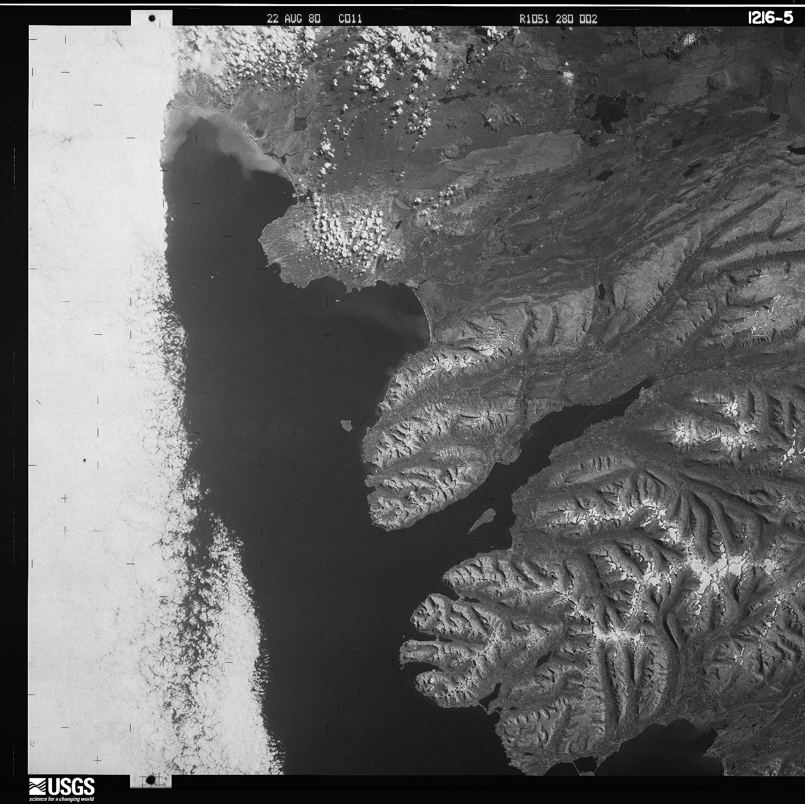
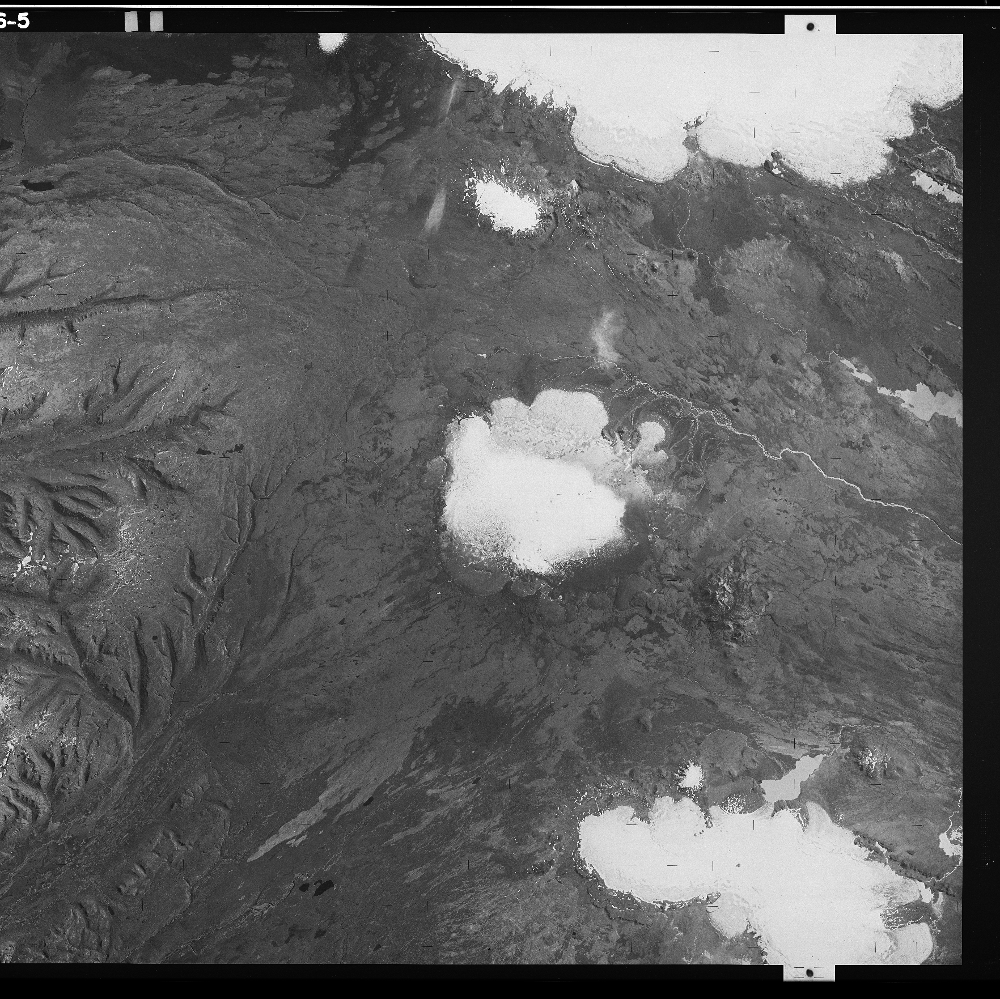

joining image scans
===================

Because of the large size of the film, USGS scans declassified satellite images in two or more pieces with a small
amount of overlap, as shown in the example below:

|br| In ``spymicmac``, the function to join the images is :py:meth:`spymicmac.image.join_hexagon`, with a corresponding
command-line tool :doc:`../../../../spymicmac/scripts/join_hexagon`.

Normally, the scans are labelled 'a' and 'b', with 'a' corresponding to the left-hand scan, and 'b' corresponding to
the right-hand scan. This is what :py:meth:`spymicmac.image.join_hexagon` is expecting - that the overlap between the
two halves is the right-hand side of image 'a', and the left-hand side of image 'b'.

After calling :py:meth:`spymicmac.image.join_hexagon`, the image should look something like this:

.. image:: img/joined.png
    :width: 98%
    :align: center
    :alt: a re-sampled and joined KH-9 image showing Hofsjökull, Iceland

|br| As there is sometimes a difference in brightness between the two halves, :py:meth:`spymicmac.image.join_hexagon`
has the option to blend the two halves over the overlap by averaging the values from the two halves, starting from
100% of the value of image 'a', linearly increasing to 100% of the value of image 'b' at the end of the
overlapping part.

Once you have joined the image scans together, you can move on to finding the :doc:`réseau marks <reseau>` (or the
:doc:`image border <panoramic>`, if using panoramic images), to be able to resample the images to a consistent
geometry.
