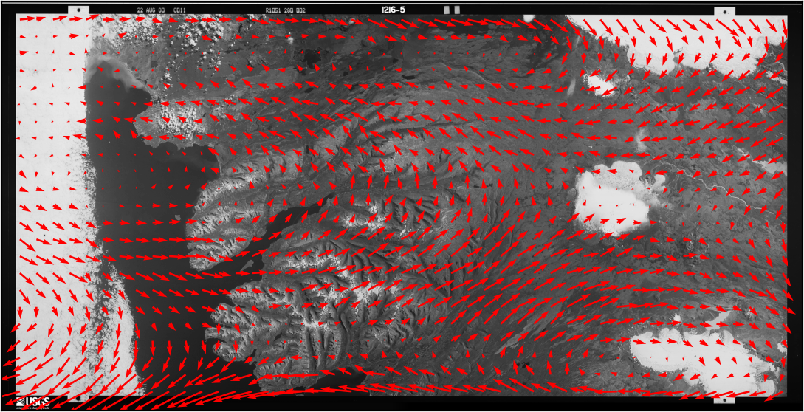
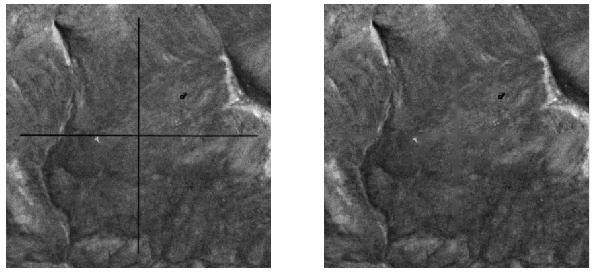

réseau grid
============

To help re-sample images to a common format, and to correct some of the distortion in the images caused by film
storage, :py:meth:`spymicmac.matching` includes a routine to automatically find the réseau markers in the image and
use their locations to resample the images using :py:meth:`spymicmac.resample.resample_hex`.

In the images below, you can see the difference between the expected location of each réseau marker and the
automatically detected locations:

|br| To run the routine, use either :py:meth:`spymicmac.matching.find_reseau_grid` or
:doc:`../../../../spymicmac/scripts/find_reseau_grid`. This will produce a ``MeasuresIm`` file that will be read by
:py:meth:`spymicmac.resample.resample_hex`.

.. note::
    Before running :py:meth:`spymicmac.resample.resample_hex`, you will also need to run
    :doc:`../../../../spymicmac/scripts/generate_micmac_measures` in order to generate the ``MeasuresCamera.xml`` file
    needed, then move ``MeasuresCamera.xml`` to the ``Ori-InterneScan`` directory in the correct folder.

    If you are running these steps using the :doc:`../../../../spymicmac/scripts/preprocess_kh9` convenience tool,
    these files will be automatically generated.

cross removal
--------------

Once you have found the Reseau marks in each image half, you can "remove" the Reseau marks using either
:py:meth:`spymicmac.matching.remove_crosses` or :doc:`../../../../spymicmac/scripts/remove_crosses`.

|br| After this step, you can use :doc:`../../../../spymicmac/scripts/resample_hexagon`.

.. tip::

    Because ``mm3d ReSampFid`` calculates an affine transform based on the fiducial marker locations, it does not
    actually correct the image using the marker locations. For KH-9 Mapping Camera images, it's better to use
    :doc:`../../../../spymicmac/scripts/resample_hexagon`.

