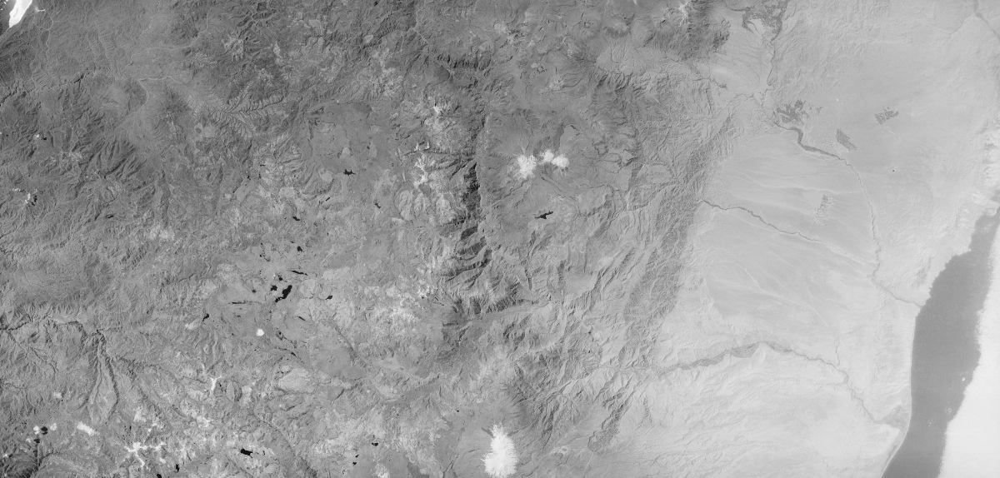
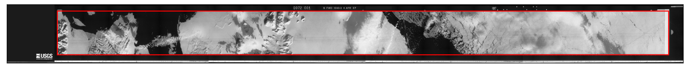

image resampling
================

KH-9 mapping camera images
--------------------------

To resample KH-9 Hexagon Mapping Camera images, use either :py:meth:`spymicmac.resample.resample_hex` or
:doc:`../../../spymicmac/scripts/resample_hexagon`.

This uses the réseau marker locations, along with :py:meth:`gdal.Warp`, a thin plate spline transformation, and
bilinear resampling (by default) to warp the image to the grid defined by the réseau markers and the desired scale
(in px/mm):

.. code-block:: python

    from spymicmac import resample
    resample.resample_hex(fn_img, 70)

Using a value of 70 (the default used by :py:meth:`spymicmac.preprocessing.preprocess_kh9mc` will resample the images
to approximately 14 microns resolution (0.014 mm/px), creating images that are 32200 x 15400 pixels in size:

panoramic camera images
-----------------------

To resample panoramic camera images (e.g., KH-4/A/B or KH-9), use :py:meth:`spymicmac.resample.crop_panoramic`:

.. code-block:: python

    from spymicmac import resample
    resample.crop_panoramic(fn_img, 'KH4')

This function first attempts to rotate the image by finding the horizontal rail markers or pseudofiducial markers (if
they exist). Then, it uses :py:meth:`spymicmac.image.get_rough_frame`

Then, the (rough) image border is detected, using :py:meth:`spymicmac.image.get_rough_frame`:

|br| the image is then cropped to this border and, optionally, re-sampled to a smaller size:

.. image:: declass/img/pan_cropped.png
    :width: 98%
    :align: center
    :alt: a re-sampled and joined KH-4 image with the original border removed

aerial images
-------------

using mm3d ReSampFid
^^^^^^^^^^^^^^^^^^^^^

After you have found each of the fiducial marks in each image and generated a MeasuresIm file for each image, either by
hand or using ``mm3d Kugelhupf``, you can run ``ReSampFid``:

.. code-block:: text

    *****************************
    *  Help for Elise Arg main  *
    *****************************
    Mandatory unnamed args :
      * string :: {Pattern image}
      * REAL :: {Resolution of scan, mm/pix}
    Named args :
      * [Name=BoxCh] Box2dr :: {Box in Chambre (generally in mm, [xmin,ymin,xmax,ymax])}
      * [Name=Kern] INT :: {Kernel of interpol,0 Bilin, 1 Bicub, other SinC (fix size of apodisation window), Def=5}
      * [Name=AttrMasq] string :: {Atribut for masq toto-> toto_AttrMasq.tif, NONE if unused, Def=NONE}
      * [Name=ExpAff] bool :: {Export the affine transformation}

For example, to re-sample the images to 14 microns (0.014 mm per pixel):

.. code-block:: sh

    mm3d ReSampFid "AR5.*tif" 0.014

The re-sampled images will have OIS-Reech\_ appended to the filename, e.g.:

.. code-block:: text

    AR5840034159994.tif -> OIS-Reech_AR5840034159994.tif

These are the images that you will use for the remaining steps - you might want to create a new folder to place the
original images.

using resample_fiducials
^^^^^^^^^^^^^^^^^^^^^^^^

Alternatively, you can use :py:meth:`spymicmac.resample.resample_fiducials`, which computes a transformation between
the fiducial marker locations defined in ``MeasuresCamera.xml`` and the locations identified in the image to warp
the image:

.. code-block:: python

    from spymicmac import resample
    from skimage.transform import AffineTransform
    resample.resample_fiducials(fn_img, 70, transform=AffineTransform())

By default, :py:meth:`spymicmac.resample.resample_fiducials` uses an affine transformation, but any
`skimage.transform <https://scikit-image.org/docs/stable/api/skimage.transform.html#module-skimage.transform>`__
transformation will work.

Using the ``nproc`` argument, it is also possible to process multiple images at once using multiprocessing.
