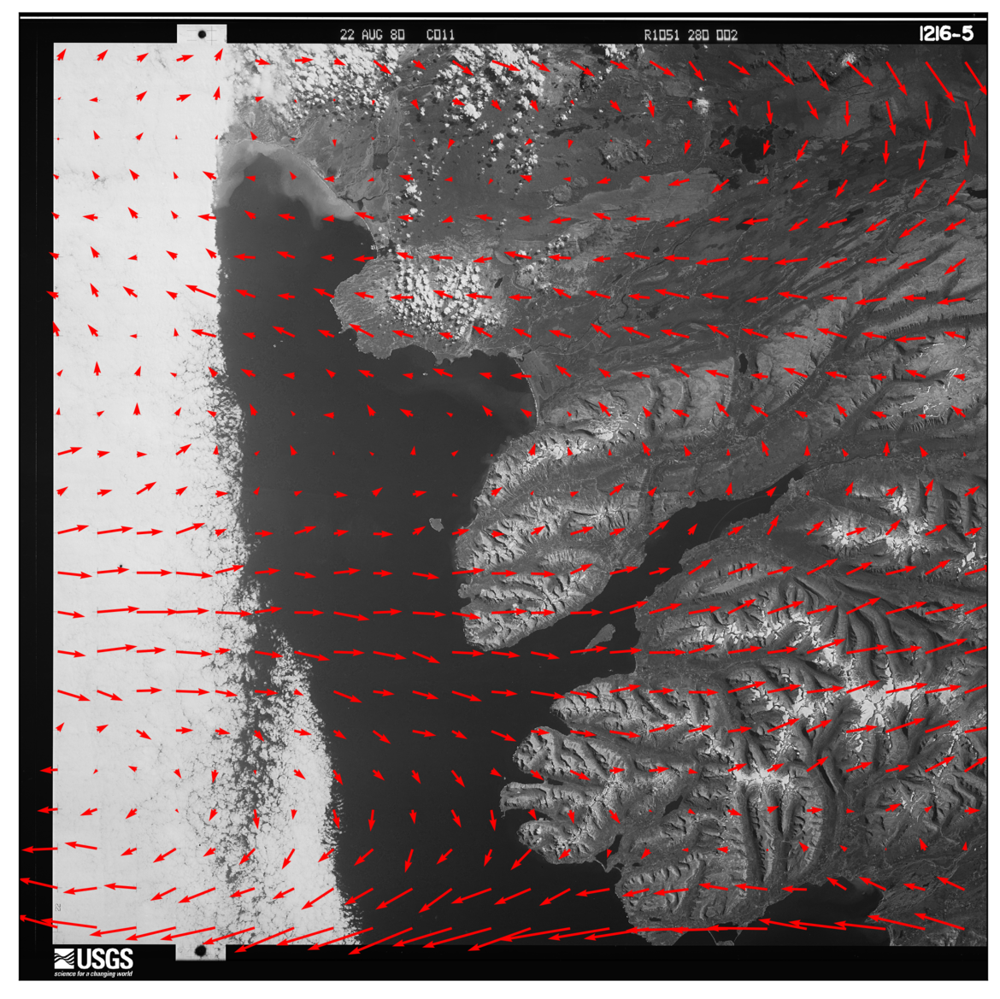
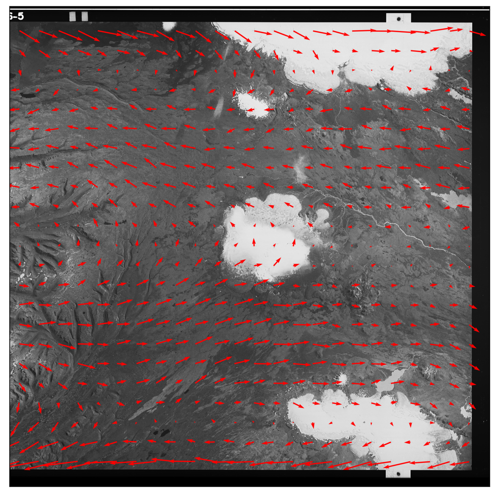
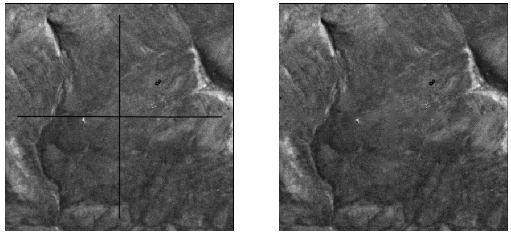
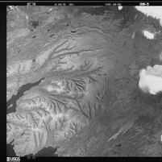
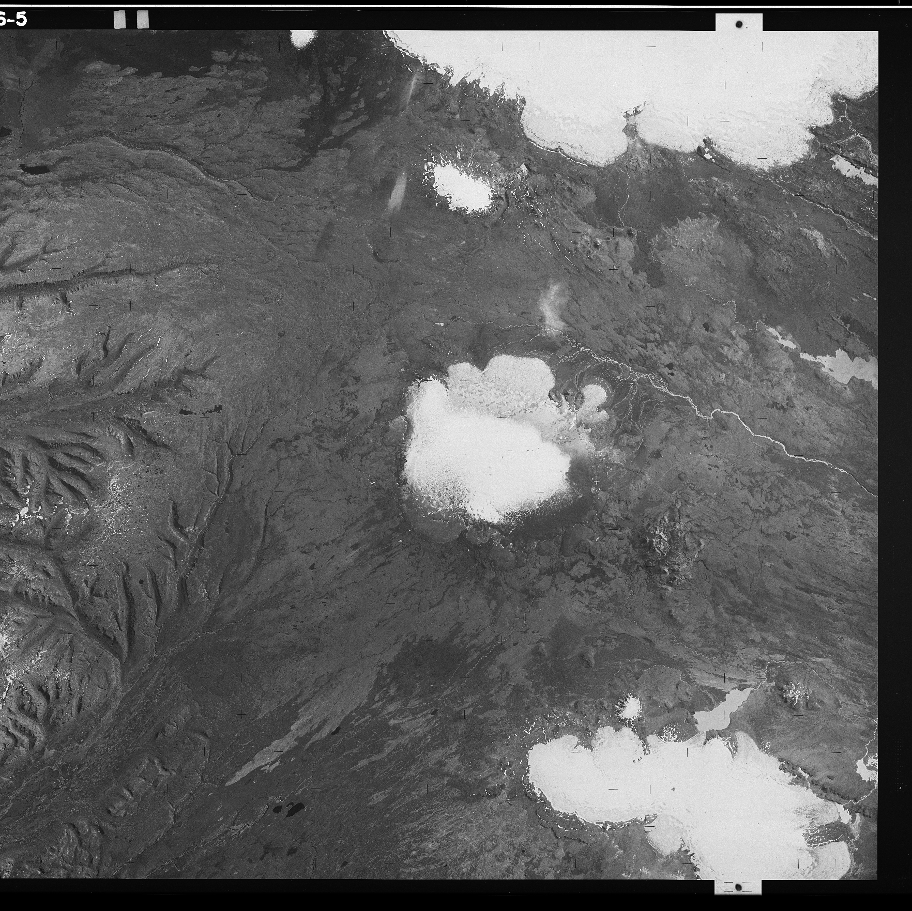

KH-9 pre-processing steps
==========================
There are a number of necessary pre-processing steps when working with KH-9 imagery. Distortions in the film,
caused by storage and other conditions, must be corrected to be able to accurately process the images. After
resampling, it is also possible to remove the Reseau marks from the images,
in order to improve the final results. Finally, because of the size of the film (approx. 9"x18"),
the images are scanned in two halves that must be joined together. And finally, it can also be helpful to improve
contrast in the images, in order to help improve the final results.

reseau field
-------------
To help correct some of the distortion in the images caused by film storage, :py:meth:`sPyMicMac.image` includes
a routine to automatically find the Reseau markers in the image and use their locations to resample the images using
``ReSampFid``. In the images below, you can see the difference between the expected location of each Reseau marker
and the automatically detected locations:

To run the routine, use either :py:meth:`sPyMicMac.image.find_reseau_grid` or
:doc:`../../sPyMicMac/scripts/find_reseau_grid`. This will produce a ``MeasuresIm`` file that will be read
by ``ReSampFid``.

.. note::
    Before running ``ReSampFid``, you will also need to run :doc:`../../sPyMicMac/scripts/generate_micmac_measures`
    in order to generate the ``MeasuresCamera.xml`` file needed.

cross removal
--------------
Once you have found the Reseau marks in each image half, you can "remove" the Reseau marks using either
:py:meth:`sPyMicMac.image.remove_crosses` or :doc:`../../sPyMicMac/scripts/remove_crosses`.

After this step, you can use :doc:`../../sPyMicMac/scripts/resample_hexagon`, or call ``mm3d ReSampFid`` directly,
to re-sample the images before joining the two halves together.

image joining
--------------
Because of the large size of the film, USGS scans the images in two halves with a small amount of overlap, as shown in
the example below.

In ``sPyMicMac``, the function to join the images is :py:meth:`sPyMicMac.image.join_hexagon`. Normally, the scans are
labelled 'a' and 'b', with 'a' corresponding to the left-hand scan, and 'b' corresponding to the right-hand scan.
This is what :py:meth:`sPyMicMac.image.join_hexagon` is expecting - that the overlap between the two halves is the
right-hand side of image 'a', and the left-hand side of image 'b'.

As there is sometimes a difference in brightness between the two halves, ``spymicmac.image.join_hexagon()`` has the
option to blend the two halves over the overlap by averaging the values from the two halves, starting from
100% of the value of image 'a', linearly increasing to 100% of the value of image 'b' at the end of the
overlapping part.

contrast enhancement
---------------------
Most of the scanned KH-9 images provided by USGS do not have issues with striping. However, they can still be
low contrast, and it can help to use either of :py:meth:`sPyMicMac.image.stretch_image` or
:py:meth:`sPyMicMac.image.contrast_enhance` for this. For examples of these functions applied to a historical aerial
image, see :ref:`contrast-enhancement`.
