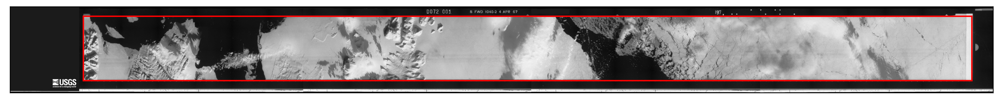

panoramic pre-processing steps
===============================

.. note::

    MicMac does not currently have an `optical bar <https://en.wikipedia.org/wiki/Optical_Bar_Camera>`__ camera
    available, which means that it is not currently possible to process KH-4* or KH-9 Panoramic Camera imagery
    using MicMac.

    To process these images, you will need to install NASA's Ames Stereo Pipeline (ASP), which can be used for further
    processing.

As with the KH-9 Mapping Camera imagery, there are a number of pre-processing steps that must be done first. If you
have a number of images, the convenience tool :doc:`../../spymicmac/scripts/preprocess_pan` will do the following
steps, starting from tarballs of the image halves (as downloaded from USGS):

- extract the images from tar files (moving the tar files to a new folder, "tarballs")
- join the scanned image parts
- filter images using a 1-sigma Gaussian Filter to reduce noise in the scanned images
- rotate and crop the images to remove the image frame
- use contrast-limited adaptive histogram equalization (CLAHE) to improve the contrast in the image

Some of these steps, including the relevant ``spymicmac`` functions, are detailed further below.

image joining
---------------
Because of the large size of the film, USGS scans the images in two halves with a small amount of overlap, as shown in
the example below.

.. image:: ../../img/pan_a.png
    :width: 24%

.. image:: ../../img/pan_b.png
    :width: 24%

.. image:: ../../img/pan_c.png
    :width: 24%

.. image:: ../../img/pan_d.png
    :width: 24%

|br| In ``spymicmac``, the function to join these images is :py:meth:`spymicmac.image.join_hexagon`, with a
corresponding command-line tool :doc:`../../spymicmac/scripts/join_hexagon`.

Normally, the scans are labelled 'a', 'b', 'c', and so on, with 'a' corresponding to the left-most part of the image.
This is what :py:meth:`spymicmac.image.join_hexagon` is expecting - that the overlap between the image parts is on the
right-hand side of image 'a' and the left-hand side of image 'b'; on the right-hand side of image 'b' and the left-hand
side of image 'c', and so on.

After calling ``join_hexagon``, the image should look something like this:

.. image:: ../../img/pan_joined.png
    :width: 98%
    :align: center
    :alt: a re-sampled and joined KH-4 image showing Nordaustlandet, Svalbard

|br| As there is sometimes a difference in brightness between the image parts, :py:meth:`spymicmac.image.join_hexagon`
has the option to blend over the overlap by averaging the values from each successive part, starting from
100% of the value of the left-hand image, linearly increasing to 100% of the value of the right-hand image at the end
of the overlapping part.

resampling using the frame
---------------------------

Unlike with the KH-9 Mapping Camera, for KH-4* and KH-9 PC images, there are no Reseau markers available
to help resample the images. Instead, :py:meth:`spymicmac.resample.crop_panoramic` can be used to first rotate the
image based on the detected locations of either rail marks (for KH-4 images) or "wagon wheel" marks (for KH-9 PC
images).

Then, the (rough) image border is detected, using :py:meth:`spymicmac.image.get_rough_frame`:

|br| the image is then cropped to this border and, optionally, re-sampled to a smaller size:

.. image:: ../../img/pan_cropped.png
    :width: 98%
    :align: center
    :alt: a re-sampled and joined KH-4 image with the original border removed

|br| In both cases, if the image is from the aft camera (as determined by the filename), then the image is rotated by
180° before being saved to the disk.

If you have a rough idea of where the image border is (using the left, right, top, and bottom coordinates), you can
also use :py:meth:`crop_from_extent` to resample the image. This is especially useful for cases where one part of the
image is over dark water, for example.

next steps
-----------

Once the images have been resampled, you can follow the
`ASP Examples <https://stereopipeline.readthedocs.io/en/latest/examples.html>`__ for the relevant image type in order
to georeference the images and extract a DEM.
