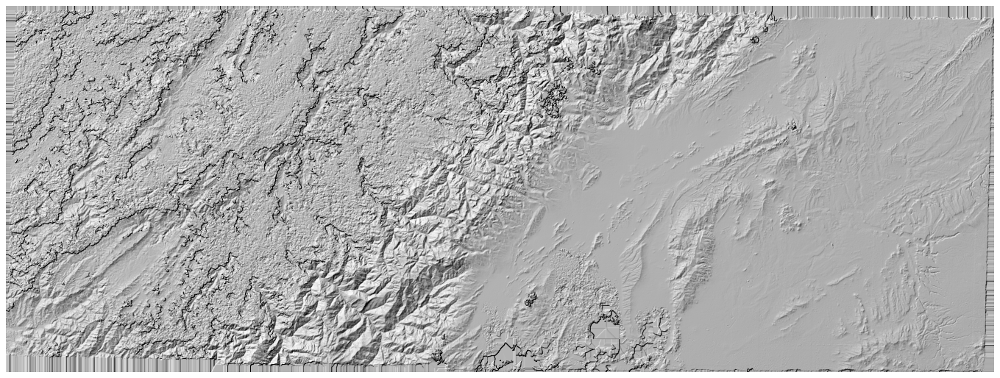
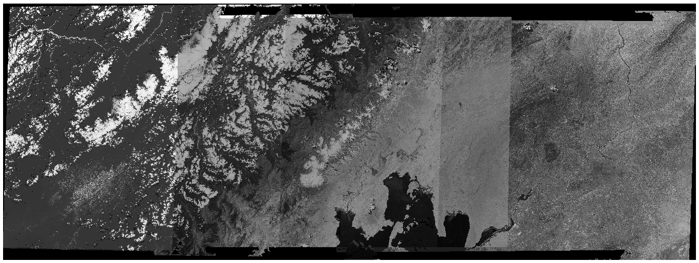

computing the relative dem and orthophoto
==========================================

Once you have the relative orientation, you can use `Malt <https://micmac.ensg.eu/index.php/Malt>`_ to compute
a relative DEM and orthoimages:

.. code-block:: sh

    mm3d Malt Ortho "OIS.*tif" Relative DirMEC=MEC-Relative NbVI=2 ZoomF=4 DefCor=0 CostTrans=1 EZA=1

This will run ``Malt`` on all of the images, using the orientation described in ``Ori-Relative``. ``Malt`` defaults
to only running where 3 or more images are visible (``NbVI=3``), but it is usually fine to go with 2 images. At this
stage, we don't necessarily need the DEM to be processed to full resolution - a lower-resolution version (``ZoomF=4``
or ``ZoomF=8``) will suffice. The ``EZA=1`` argument ensures that the values in the DEM are in the correct units.

Alternatively, using :py:meth:`spymicmac.micmac.malt`:

.. code-block:: python

    from spymicmac import micmac
    micmac.malt('OIS.*tif', 'Relative',
        zoomf=4,
        dirmec='MEC-Relative',
        cost_trans=1
    )

Once this command finishes, you will have two new directories: ``MEC-Relative`` and ``Ortho-MEC-Relative``. The DEM
and associated correlation masks are found in ``MEC-Relative``, while the orthophotos are found in
``Ortho-MEC-Relative``.

You can visualize the DEM in a GIS software (for example, QGIS):

|br| Assuming that the relative orientation, visualized with ``AperiCloud``, is in good shape, the DEM hillshade should
look similar to a real-world hillshade of the study area - this is how :py:meth:`spymicmac.register.register_relative`
works to register the images to real-world control points and compute the absolute orientation.

creating the orthomosaic using Tawny
------------------------------------

You can also create a relative orthomosaic using the images in ``Ortho-MEC-Relative``. After calling ``Malt``, these
images will only be the individual images orthorectified using the extracted
DEM.

To generate an orthomosaic, we use `Tawny <https://micmac.ensg.eu/index.php/Tawny>`_:

.. code-block:: sh

    mm3d Tawny Ortho-MEC-Relative Out=Orthophotomosaic.tif RadiomEgal=0

Here, we use ``RadiomEgal=0`` to use the images as-is, rather than attempting to balance the radiometry (as this
can lead to undesirable results).

Alternatively, using :py:meth:`spymicmac.micmac.tawny`:

.. code-block:: python

    from spymicmac import micmac
    micmac.tawny('MEC-Relative')

Finally, you might need to re-combine the image tiles using
:py:meth:`spymicmac.micmac.mosaic_micmac_tiles` (or :doc:`../../spymicmac/scripts/mosaic_micmac_tiles`) depending on
how large they are:

.. code-block:: sh

    mosaic_micmac_tiles Orthophotomosaic -imgdir Ortho-MEC-Relative

As with the DEM, you can visualize the orthomosaic in a GIS software:

|br| Once this is complete, you can move on to the next step: registering the DEM or orthoimage and automatically
finding control points using an external DEM and satellite image.
