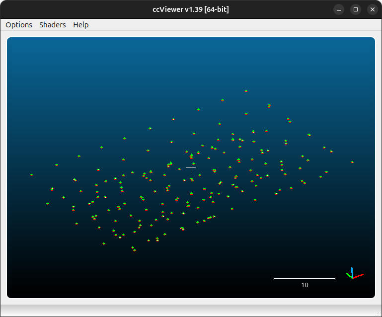
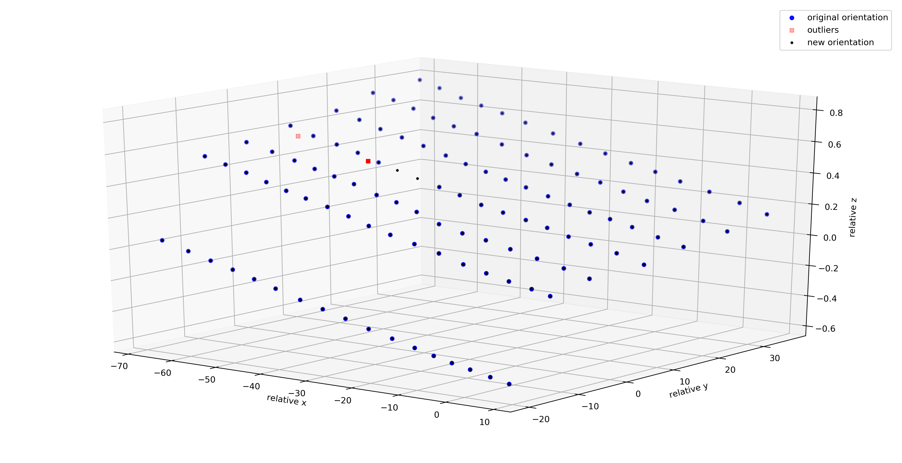

finding the relative orientation
================================

After pre-processing the images, the next step in processing is to compute the intrinsic camera parameters, and
find an initial external orientation for the images. At this stage, this is done in an arbitrary, *relative*
coordinate system.

Tapas
-----

The basic tool for computing relative orientation in MicMac is `Tapas <https://micmac.ensg.eu/index.php/Tapas>`_:

.. code-block:: sh

    mm3d Tapas <ModeCalib> <Pattern>

which can also be called using the :py:meth:`spymicmac.micmac.tapas` wrapper. In order to run ``Tapas``, you need to
specify a **Calibration Mode** - that is, the type of calibration to use.

MicMac has a number of calibration modes available - to see a full list, use the following command:

.. code-block:: sh

    mm3d Tapas -help

which will print something like the following list:

.. code-block:: text

    Authorized models :
       RadialBasic
       RadialExtended
       Fraser
       FishEyeEqui
       AutoCal
       Figee
       HemiEqui
       RadialStd
       FraserBasic
       FishEyeBasic
       FE_EquiSolBasic
       Four7x2
       Four11x2
       Four15x2
       Four19x2
       AddFour7x2
       AddFour11x2
       AddFour15x2
       AddFour19x2
       AddPolyDeg0
       AddPolyDeg1
       AddPolyDeg2
       AddPolyDeg3
       AddPolyDeg4
       AddPolyDeg5
       AddPolyDeg6
       AddPolyDeg7
       Ebner
       Brown
       FishEyeStereo

The basic syntax is (here, using ``RadialExtended``):

.. code-block:: sh

    mm3d Tapas RadialExtended "OIS.*tif"

though typically, we save this orientation as "Relative":

.. code-block:: sh

    mm3d Tapas RadialExtended "OIS.*tif" Out=Relative

initializing a calibration
--------------------------

With a large number of images, it might help to create an initial calibration based on a few "nice" images (i.e.,
plenty of tie points/contrast) before trying to run the calibration on the entire set of images:

.. code-block:: sh

    mm3d Tapas RadialExtended "<Image>(1-5).tif" Out=CalibInit SH=HomolMasqFiltered LibFoc=0

This will create an initial directory, ``Ori-CalibInit``, based on the images specified by the search pattern. Once
you have a stable initial calibration, you can use this to seed the calibration for the entire block of images:

.. code-block:: sh

    mm3d Tapas RadialExtended "OIS.*tif" InCal=CalibInit Out=Relative SH=HomolMasqFiltered LibFoc=0

This will create a new directory, ``Ori-Relative``, that contains orientation files for each of the different images
in the directory, as well as the calibration file for :ref:`each camera <multicam>` specified in
``MicMac-LocalChantierDescripteur.xml``.

visualizing the orientation
---------------------------

If ``Tapas`` successfully completes, you can then create a point cloud to visualize the relative orientation and
inspect it for any errors:

.. code-block:: sh

    mm3d AperiCloud "OIS.*tif" Relative

alternatively, with :py:meth:`spymicmac.micmac.apericloud`:

.. code-block:: python

    from spymicmac import micmac
    micmac.apericloud('Relative')

You can then open the ``.ply`` file using, for example, `Cloud Compare <https://www.danielgm.net/cc/>`_ or
`Meshlab <https://www.meshlab.net/>`_:

.. image:: ../../img/relative_ply.png
    :width: 600
    :align: center
    :alt: a point cloud showing the relative orientation for a block of images

|br|

KH-9 Hexagon mapping camera
---------------------------

For KH-9 Hexagon mapping camera processing, ``spymicmac`` uses
`RadialExtended <https://micmac.ensg.eu/index.php/Tapas#RadialExtended>`_ by default, which uses 5 polynomial
coefficients to estimate the radial distortion: :math:`r^3, r^5, r^7, r^9, r^{11}`.

To help initialize the calibration, :py:meth:`spymicmac.preprocessing.preprocess_kh9_mc` uses
:py:meth:`spymicmac.micmac.init_autocal` to create a directory with calibration files, ``Ori-Init``,
that can be passed to ``Tapas`` using ``InCal=Init``.

Because ``Tapas`` with ``RadialExtended`` is likely to diverge due to the number of degrees of freedom and residual
distortion in the images, the default behavior in :py:meth:`spymicmac.preprocessing.preprocess_kh9_mc` is to hold the
focal length, center of distortion, and principal point constant (``LibFoc=0``, ``LibCD=0``, and ``LibPP=0``,
respectively):

.. code-block:: sh

    mm3d Tapas RadialExtended "OIS.*tif" InCal=Init Out=Relative LibFoc=0 LibCD=0 LibPP=0

This typically works well as an estimate for the camera distortion, but it is also possible to combine the higher-order
distortion model used by ``RadialExtended`` with affine and decentric correction parameters, as used in models such as
``Fraser`` or ``FraserBasic``.

If you are using :py:meth:`spymicmac.preprocessing.preprocess_kh9_mc`, using ``add_params=True`` will initialize the
decentric and affine correction parameters with a value of 0; if the bundle block adjustment using ``Campari`` is
run with ``AllFree=1``, these parameters will also be optimized at this stage.

If you are not using :py:meth:`spymicmac.preprocessing.preprocess_kh9_mc`, you can still add these parameters to the
higher-order distortion model in the following way:

.. code-block:: python

    from spymicmac import micmac
    cam = micmac.load_cam_xml(fn_cam)
    micmac.write_cam_xml(fn_cam, cam, fraser=True)

where ``fn_cam`` the name of the camera XML file to read/write.

.. caution::

    This feature has not been tested on all available calibration modes used by ``Tapas``, so use with caution!

Martini
-------

``Martini`` is a MicMac command that can be extremely useful for creating an initial orientation that can be used by
``Tapas``:

.. code-block:: text

    *****************************
    *  Help for Elise Arg main  *
    *****************************
    Mandatory unnamed args :
      * string :: {Image Pat}
    Named args :
      * [Name=Exe] bool :: {Execute commands, def=true (if false, only print)}
      * [Name=OriCalib] string :: {Orientation for calibration }
      * [Name=SH] string :: {Prefix Homologue , Def=""}
      * [Name=ExtName] string :: {User's added Prefix , Def=""}
      * [Name=ExpTxt] bool :: {Homol in text format? , Def="false"}
      * [Name=ModeNO] string :: {Mode Def=Std (TTK StdNoTTK OnlyHomogr)}
      * [Name=InOri] string :: {Existing orientation if any}
      * [Name=OriOut] string :: {Output orientation dir}
      * [Name=OriGPS] string :: {Orientation where find gps data when exists}
      * [Name=OriCheck] string :: {Reference Orientation  to check results}
      * [Name=Debug] bool :: {Debug ....}
      * [Name=AUS] bool :: {Accept non symetric homologous point;}
      * [Name=Quick] bool :: {If true (default) do less test}
      * [Name=StdNbPtTrip] INT :: {Max num of triplets per edge (Std mode)}
      * [Name=QNbPtTrip] INT :: {Max num of triplets per edge (Quick mode), Def=8}
      * [Name=NbTrip] INT :: {Min num of points to calculate a triplet}
      * [Name=Show] bool :: {If true (non default) print (a lot of) messages}

A python interface for ``Martini`` is implemented in :py:meth:`spymicmac.micmac.martini`. Because ``Martini`` uses
tie points to orient images without also adjusting for camera distortion, it's better to visualize the point cloud
without also seeing the tie points:

.. code-block:: sh

    mm3d AperiCloud "OIS.*tif" Martini WithPoints=0

This will create a **.ply** file with only the camera centers drawn:

|br| Alternatively, this can be done with with python, using :py:meth:`spymicmac.micmac.martini` and
:py:meth:`spymicmac.micmac.aperi`:

.. code-block:: python

    from spymicmac import micmac

    micmac.martini('OIS.*tif')
    micmac.apericloud('Martini', 'OIS.*tif', with_points=False)

fixing the orientation
------------------------

If your ``Tapas`` output looks okay, you can move on to the next step, :doc:`malt`.

If you are unlucky, however, there are some tools in :py:meth:`spymicmac.orientation` to help manipulate the orientation
files to help ``Tapas`` converge. For example, occasionally cameras will be positioned in an incorrect location,
especially images with lots of ice/snow.

If the absolute camera positions are (approximately) known, :py:meth:`spymicmac.orientation.fix_orientation` will
estimate an affine transformation between the known absolute positions and the relative positions estimated by Tapas.

Outliers are identified by comparing the normalized median absolute deviation (NMAD) of the residuals, and the camera
positions in the orientation file are overwritten with the position estimated from the transformation using
:py:meth:`spymicmac.orientation.update_center`.

.. note::

    Once you have updated the center locations with the new estimated positions, you should re-run ``Tapas``
    using ``InOri=<Updated Orientation>``:

    .. code-block:: sh

        mm3d Tapas RadialBasic "OIS.*tif" InOri=Relative Out=Relative LibFoc=0

    In most cases (but not always!), seeding the locations in this way will help ``Tapas`` converge to a
    more accurate solution.

In the example shown below, two images (marked with red squares) have been identified as outliers using the estimated
transformation. The positions have been updated using :py:meth:`spymicmac.orientation.fix_orientation`, and re-running
``Tapas`` has helped position the cameras correctly:

|br| If the camera positions are not well-known (often the case for historic air photos), you can use
:py:meth:`spymicmac.orientation.interp_line` or :py:meth:`spymicmac.orientation.extend_line` to estimate the positions
based on an assumed flight line, using positions that have converged properly.

Once you have the new positions estimated, you should update the positions in the orientation files using
:py:meth:`spymicmac.orientation.update_center`, and re-run ``Tapas`` as shown above.
