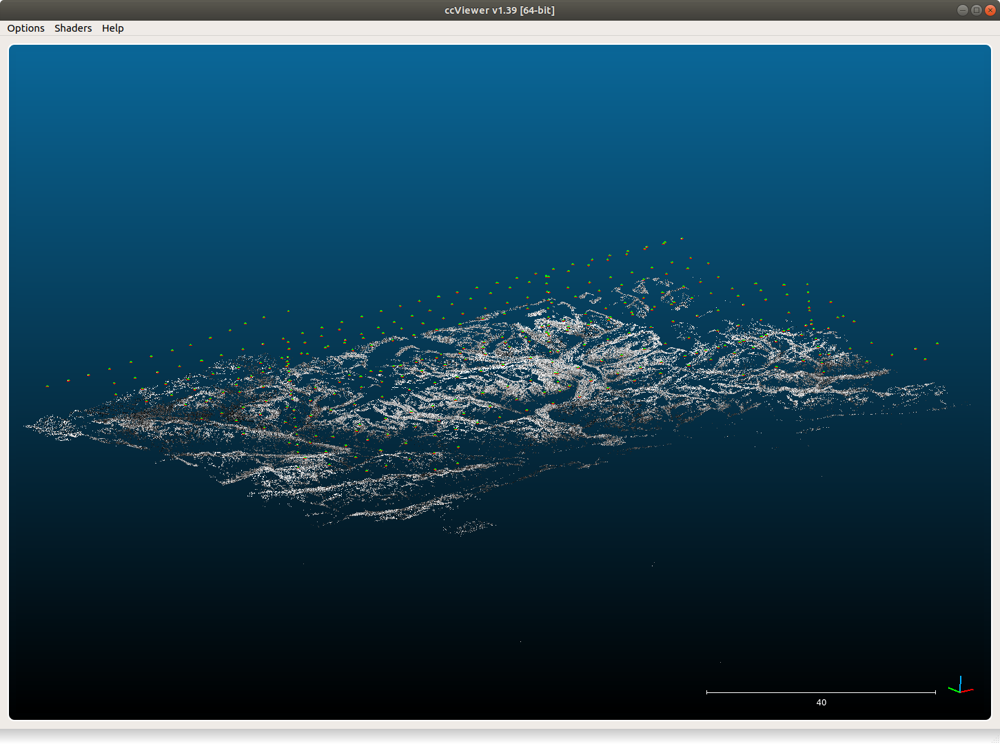

finding the relative orientation
================================

The basic tool for computing relative orientation in MicMac is `Tapas <https://micmac.ensg.eu/index.php/Tapas>`_:

.. code-block:: sh

    mm3d Tapas <CameraModel> <Pattern>

MicMac has a number of camera models. For many applications, a basic radial distortion model,
`RadialBasic <https://micmac.ensg.eu/index.php/Tapas#RadialBasic>`_, will probably suffice. This model is especially
useful in cases where models with additional degrees of freedom, such as
`RadialExtended <https://micmac.ensg.eu/index.php/Tapas#RadialExtended>`_, are likely to diverge owing to issues
with distortion in the images.

The basic syntax used for ``RadialBasic`` is:

.. code-block:: sh

    mm3d Tapas RadialBasic <Pattern> Out=<OutDir> SH=HomolMasqFiltered LibFoc=0

Here, it might help to use ``LibFoc=0`` (i.e., hold the focal length fixed at the value specified in
``MicMac-LocalChantierDescripteur.xml``), as the calibration for older images can often be unstable.

With a large number of images, it might help to create an initial calibration based on a few "nice" images (i.e.,
plenty of tie points/contrast) before trying to run the calibration on the entire set of images:

.. code-block:: sh

    mm3d Tapas RadialBasic "<Image>(1-5).tif" Out=CalibInit SH=HomolMasqFiltered LibFoc=0

This will create an initial directory, ``Ori-CalibInit``, based on the images specified by the search pattern. Once
you have a stable initial calibration, you can use this to seed the calibration for the entire block of images:

.. code-block:: sh

    mm3d Tapas RadialBasic "OIS.*tif" InCal=CalibInit Out=Relative SH=HomolMasqFiltered LibFoc=0

This will create a new directory, ``Ori-Relative``, that contains orientation files for each of the different images
in the directory, as well as the calibration for each "camera" specified in ``MicMac-LocalChantierDescripteur.xml``.

If ``Tapas`` successfully completes, you can then create a point cloud to visualize the relative orientation and
inspect it for any errors:

.. code-block:: sh

    mm3d AperiCloud "OIS.*tif" Relative SH=HomolMasqFiltered

You can then open the ``.ply`` file using, for example, `Cloud Compare <https://www.danielgm.net/cc/>`_ or
`Meshlab <https://www.meshlab.net/>`_:

|br|

fixing the orientation
------------------------
If your `Tapas` output looks okay, you can move on to the next step, :doc:`relative`.

If you are unlucky, however, there are some tools in :py:meth:`spymicmac.orientation` to help manipulate the orientation
files to help ``Tapas`` converge. For example, occasionally cameras will be positioned in an incorrect location,
especially images with lots of ice/snow.

If the absolute camera positions are (approximately) known, :py:meth:`spymicmac.orientation.fix_orientation` will
estimate an affine transformation between the known absolute positions and the relative positions estimated by Tapas.

Outliers are identified by comparing the normalized median absolute deviation (NMAD) of the residuals, and the camera
positions in the orientation file are overwritten with the position estimated from the transformation using
:py:meth:`spymicmac.orientation.update_center`.

.. note::

    Once you have updated the center locations with the new estimated positions, you should re-run ``Tapas``
    using ``InOri=<Updated Orientation>``:

    .. code-block:: sh

        mm3d Tapas RadialBasic "OIS.*tif" InOri=Relative Out=Relative LibFoc=0

    In most cases (but not always!), seeding the locations in this way will help ``Tapas`` converge to a
    more accurate solution.

In the example shown below, two images (marked with red squares) have been identified as outliers using the estimated
transformation. The positions have been updated using :py:meth:`spymicmac.orientation.fix_orientation`, and re-running
``Tapas`` has helped position the cameras correctly:

.. image:: ../../img/fixed_orientation.png
    :width: 98%
    :align: center
    :alt: a point cloud showing the relative orientation for a block of images

|br| If the camera positions are not well-known (often the case for historic air photos), you can use
:py:meth:`spymicmac.orientation.interp_line` or :py:meth:`spymicmac.orientation.extend_line` to estimate the positions
based on an assumed flight line, using positions that have converged properly.

Once you have the new positions estimated, you should update the positions in the orientation files using
:py:meth:`spymicmac.orientation.update_center`, and re-run ``Tapas`` as shown above.
